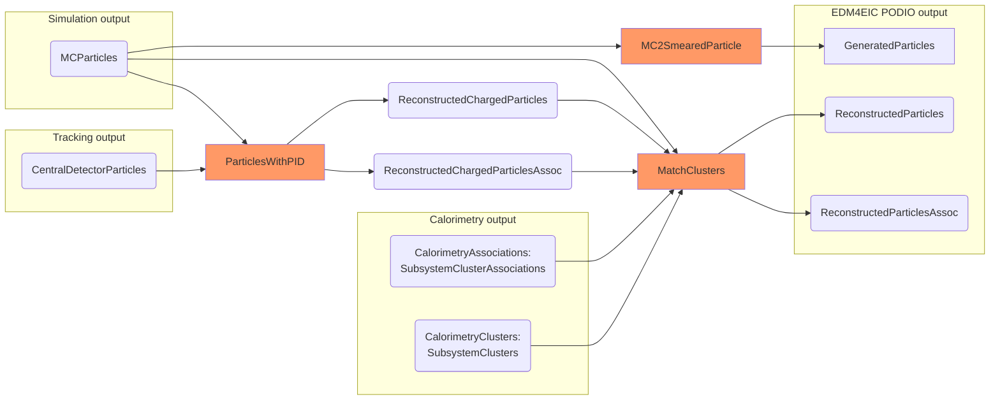

# Particle matching

```mermaid
flowchart LR
  classDef alg fill:#f96;

  subgraph Tracking output
    direction TB
    TrackingOutput(CentralDetectorParticles)
  end

  subgraph Simulation output
    direction TB
    MCParticles(MCParticles)
  end

  subgraph Calorimetry output
    direction TB

    CalorimetryClusters(CalorimetryClusters:<br/>SubsystemClusters)
    CalorimetryAssociations(CalorimetryAssociations:<br/>SubsystemClusterAssociations)
  end

  MCParticles --> MC2SmearedParticle[MC2SmearedParticle]:::alg
  MC2SmearedParticle --> GeneratedParticles

  MCParticles --> ParticlesWithPID[ParticlesWithPID]:::alg
  TrackingOutput --> ParticlesWithPID

  ParticlesWithPID --> ReconstructedChargedParticles(ReconstructedChargedParticles)
  ParticlesWithPID --> ReconstructedChargedParticlesAssoc(ReconstructedChargedParticlesAssoc)

  MCParticles --> MatchClusters[MatchClusters]:::alg
  ReconstructedChargedParticles --> MatchClusters
  ReconstructedChargedParticlesAssoc --> MatchClusters

  CalorimetryAssociations --> MatchClusters
  CalorimetryClusters --> MatchClusters

  MatchClusters --> ReconstructedParticles(ReconstructedParticles)
  MatchClusters --> ReconstructedParticlesAssoc(ReconstructedParticlesAssoc)

  subgraph EDM4EIC PODIO output
    direction TB

    ReconstructedParticles
    ReconstructedParticlesAssoc
    GeneratedParticles
  end

```
