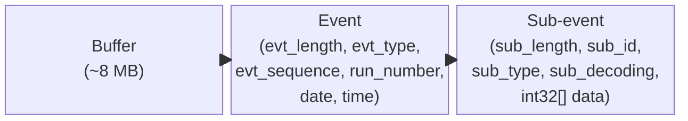
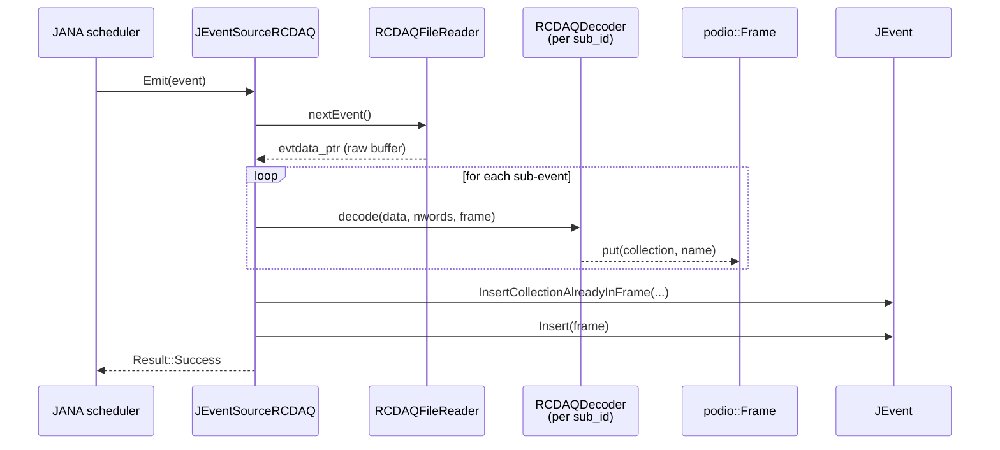
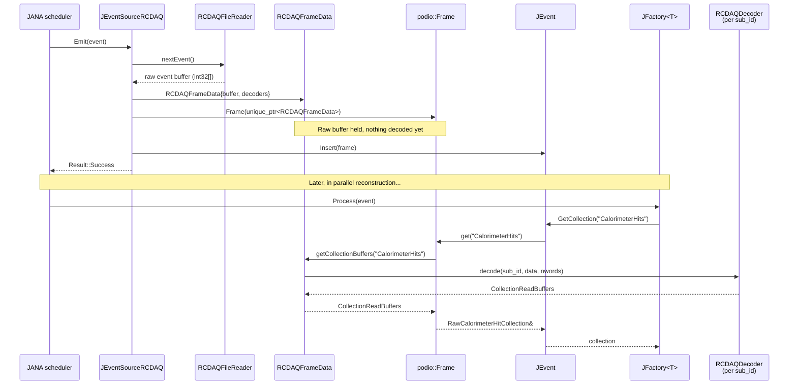
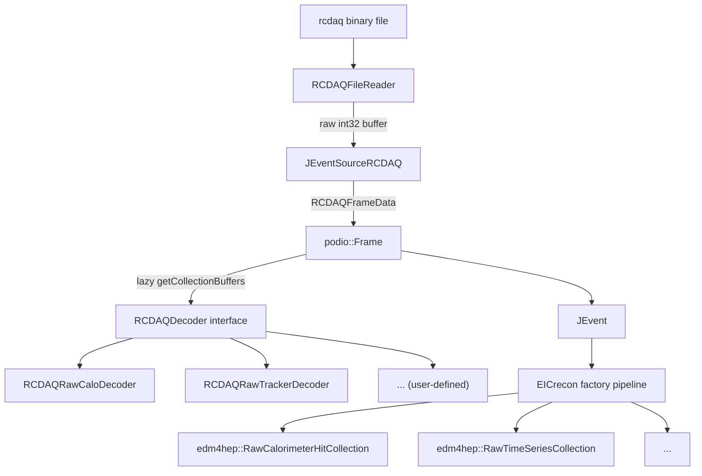
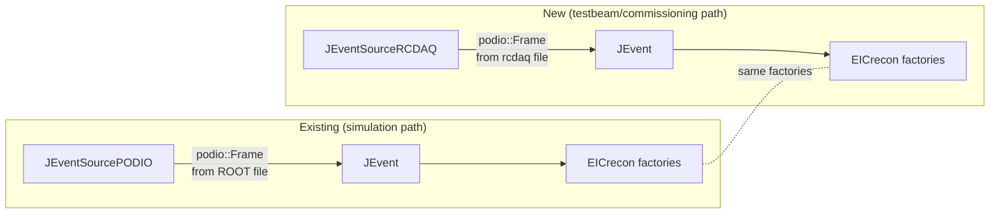

# Design: JANA2 Event Source for rcdaq Binary Files

## Motivation

[rcdaq](https://github.com/phnxdaq/rcdaq) is the data acquisition system used
for sPHENIX and EIC R&D efforts at Brookhaven National Laboratory.  Real
detector data are written in rcdaq's binary ONCS/PRDF format.  EICrecon
currently only reads simulation output stored in PODIO ROOT frames.  Adding an
rcdaq event source would allow EICrecon's reconstruction algorithms to run
directly on testbeam and commissioning data without an intermediate conversion
step.

---

## rcdaq Binary Format Overview

An rcdaq file is a sequence of fixed-size **buffers** (~8 MB each). Each buffer
contains a sequence of **events**. Each event contains one or more
**sub-events** from individual detector modules.



### Buffer header (`BufferConstants.h`)

| Field | Type | Notes |
|-------|------|-------|
| `Length` | `uint32_t` | Length in bytes |
| `ID` | `int32_t` | Format marker: `0xffffc0c0` (ONCS) or `0xffffffc0` (PRDF) |
| `Bufseq` | `int32_t` | Buffer sequence number |
| `Runnr` | `int32_t` | Run number |

Compression variants are indicated by alternative `ID` markers:
`0xfffffafe` (GZ), `0xffffbbfe` (LZO1X), `0xffffbbc0` (ONCS + LZO1X).

### Event header (`EvtStructures.h`)

| Field | Type | Notes |
|-------|------|-------|
| `evt_length` | `int32_t` | Length in 32-bit words |
| `evt_type` | `int32_t` | `DATAEVENT=1`, `BEGRUNEVENT=9`, `ENDRUNEVENT=12`, … |
| `evt_sequence` | `int32_t` | Event sequence number |
| `run_number` | `int32_t` | Run number |
| `date` | `int32_t` | Encoded date |
| `time` | `int32_t` | Encoded time |
| `reserved[2]` | `int32_t[2]` | Unused |
| `data[]` | `int32_t[]` | Variable-length payload (sub-events) |

### Sub-event header (`SubevtStructures.h`, ONCS format)

| Field | Type | Notes |
|-------|------|-------|
| `sub_length` | `int32_t` | Length in 32-bit words (incl. header) |
| `sub_id` | `int16_t` | Hardware module identifier |
| `sub_type` | `int16_t` | Sub-event type |
| `sub_decoding` | `int16_t` | Decoding hint |
| `sub_padding` | `int16_t` | Padding bytes at end |
| `reserved[2]` | `int16_t[2]` | Unused |
| `data` | `int32_t[]` | Raw payload |

---

## Architectural Options

### Option A — Eager decoding (simple baseline)

`Emit()` reads an event, immediately decodes every sub-event into EDM4hep
collections, constructs a `podio::Frame`, and inserts all collections into the
`JEvent` using the existing `InsertingVisitor` from `JEventSourcePODIO`.



**Pros:** Simple; reuses `InsertingVisitor` from `JEventSourcePODIO` unchanged.
**Cons:** All sub-events decoded even if only one collection is requested
downstream; wasted CPU when a data file contains many more detector channels
than the reconstruction job cares about.

---

### Option B — Lazy decoding via `podio::FrameDataType` (recommended)

Instead of decoding at emit time, `Emit()` wraps the raw event buffer in a
`RCDAQFrameData` object that satisfies the `podio::FrameDataType` concept.
`podio::Frame` stores this object and calls `getCollectionBuffers(name)` **only
when a specific collection is first accessed**.

This exploits the lazy-deserialization mechanism already built into
`podio::Frame`'s `FrameModel<FrameDataT>`:

```cpp
// podio/Frame.h (simplified)
template <FrameDataType FrameDataT>
struct FrameModel {
    mutable CollectionMapT m_collections; // decoded collections, filled on demand
    std::unique_ptr<FrameDataT> m_data;   // raw data, untouched until get() is called

    const CollectionBase* get(const std::string& name) const {
        if (auto it = m_collections.find(name); it != m_collections.end())
            return it->second.get();          // already decoded
        // Not yet decoded: ask raw data to produce buffers
        auto buffers = m_data->getCollectionBuffers(name);
        // ... reconstruct collection from buffers, store in m_collections ...
    }
};
```



#### `RCDAQFrameData` interface

```cpp
class RCDAQFrameData {
public:
    // Construct from a raw event buffer and a map of registered decoders
    RCDAQFrameData(std::vector<int32_t> raw_buffer,
                   const DecoderMap& decoders);

    // --- podio::FrameDataType concept requirements ---

    // Returns an ID table mapping collection names → integer IDs
    podio::CollectionIDTable getIDTable() const;

    // Decode the sub-event for `name` and return podio buffer structures.
    // Called lazily by podio::Frame when a collection is first requested.
    std::optional<podio::CollectionReadBuffers>
    getCollectionBuffers(const std::string& name);

    // Returns the names of all collections that COULD be decoded from this event
    // (i.e. sub-event IDs that have a registered decoder)
    std::vector<std::string> getAvailableCollections() const;

    // Returns event-level metadata (run number, event number, timestamp, …)
    std::unique_ptr<podio::GenericParameters> getParameters();

private:
    std::vector<int32_t> m_buffer;     // raw event payload
    const DecoderMap& m_decoders;      // sub_id → (collection_name, decoder)
};
```

**Pros:**
- Decoding is deferred until the collection is actually needed.
- A job that only reads calorimeter hits pays no cost for tracker sub-events.
- Fully compatible with PODIO's existing collection-ID-table and serialization
  machinery (important if events are later re-serialized to ROOT).

**Cons:**
- Requires implementing the `podio::FrameDataType` concept, including
  `CollectionReadBuffers` construction, which is more involved than inserting
  into an already-constructed collection.
- The current `InsertingVisitor` loop in `JEventSourcePODIO` calls
  `frame->getAvailableCollections()` eagerly and decodes everything; Option B
  requires **not** calling this loop in the new event source. The Frame is
  inserted into the JEvent directly and downstream factories pull from it.

---

### Comparison

| Criterion | Option A (eager) | Option B (lazy) |
|-----------|-----------------|-----------------|
| Implementation complexity | Low | Medium |
| CPU cost for partial reads | High (all sub-events decoded) | Low (only requested collections) |
| PODIO integration depth | Shallow | Deep (FrameDataType) |
| Re-serialization to ROOT possible | Yes | Yes (PODIO handles it) |
| Online streaming support | Easy to add | Easy to add |
| Recommended for production | Only if all collections always used | ✅ |

---

## Proposed Component Structure



### `RCDAQFileReader`

Standalone C++ class (no JANA2 or PODIO dependency):

```
RCDAQFileReader
├── open(const std::string& path) → void
├── nextEvent() → std::optional<std::vector<int32_t>>
│     reads buffer-by-buffer from disk; returns raw event int32[] or nullopt at EOF
├── runNumber() → int
├── eventSequence() → int
├── eventType() → int        (DATAEVENT, BEGRUNEVENT, ENDRUNEVENT, …)
└── close() → void
```

Handles:
- ONCS format (`0xffffc0c0`) and PRDF format (`0xffffffc0`)
- Uncompressed buffers initially; LZO decompression as optional extension
- `BEGRUNEVENT` / `ENDRUNEVENT` events for run-boundary handling

### `RCDAQDecoder` (pure virtual interface)

```cpp
class RCDAQDecoder {
public:
    virtual ~RCDAQDecoder() = default;
    virtual int             subeventID()   const = 0;
    virtual std::string     collectionName() const = 0;
    virtual std::string     collectionType() const = 0;  // for ID table / type names

    // Decode raw sub-event data into podio CollectionReadBuffers.
    // Called lazily by RCDAQFrameData::getCollectionBuffers().
    virtual podio::CollectionReadBuffers
        decode(const int32_t* data, int nwords) = 0;
};
```

Users register decoder instances with `JEventSourceRCDAQ` via JANA parameters
or a dedicated service.

### `JEventSourceRCDAQ`

```
JEventSourceRCDAQ : public JEventSource
├── Open()
│     instantiate RCDAQFileReader, open resource name
│     build decoder map from registered decoders
├── Emit(JEvent&)
│     call reader.nextEvent()  → FailureFinished at EOF
│     skip non-DATA events (BEGIN/END run → update run number)
│     set event.SetRunNumber(), event.SetEventNumber()
│     construct podio::Frame(make_unique<RCDAQFrameData>(buffer, decoders))
│     event.Insert(frame)   ← Frame held by JEvent; no eager decoding
│     return Result::Success
├── Close()
│     reader.close()
└── CheckOpenable()   ← template specialization for .rcdaq / .prdf / .evt
```

### File layout

```
src/services/io/rcdaq/
├── CMakeLists.txt
├── rcdaq.cc                      # InitPlugin()
├── JEventSourceRCDAQ.h / .cc
├── RCDAQFileReader.h / .cc
├── RCDAQDecoder.h                # pure virtual interface
├── RCDAQFrameData.h / .cc        # podio::FrameDataType implementation
└── decoders/
    ├── RCDAQRawCaloDecoder.h / .cc   # example: sub_id → RawCalorimeterHit
    └── RCDAQRawTimeSeriesDecoder.h / .cc
```

---

## Interaction with Existing EICrecon Infrastructure



Because both paths produce a `podio::Frame` inserted into the `JEvent`, all
downstream JANA factories are identical.  The reconstruction job selects the
appropriate event source automatically via `CheckOpenable()` based on the input
file extension (see [Runtime Source Selection](#runtime-source-selection) below).

---

## CMake Integration

```cmake
# src/services/io/rcdaq/CMakeLists.txt
get_filename_component(PLUGIN_NAME ${CMAKE_CURRENT_LIST_DIR} NAME)

# rcdaq headers are optional
find_package(rcdaq QUIET)
if(NOT rcdaq_FOUND)
    message(STATUS "rcdaq headers not found — rcdaq event source will not be built")
    return()
endif()

plugin_add(${PLUGIN_NAME})
plugin_glob_all(${PLUGIN_NAME})
plugin_include_directories(${PLUGIN_NAME} PRIVATE ${rcdaq_INCLUDE_DIRS})
plugin_link_libraries(
    ${PLUGIN_NAME}
    EDM4HEP::edm4hep
    podio::podioIO
    log_library)
```

The rcdaq plugin is added in `src/services/io/CMakeLists.txt`:

```cmake
add_subdirectory(podio)
add_subdirectory(rcdaq)   # gracefully skipped if rcdaq not found
```

---

## Runtime Source Selection

JANA2 provides two mechanisms for deciding which event source reads a given
input file.  No application-level code is needed beyond what is already
implemented.

### Automatic: `CheckOpenable` scoring

Every registered `JEventSourceGeneratorT<T>` implements `CheckOpenable(filename)`
and returns a confidence score in [0, 1].  JANA picks the highest-scoring
generator for each input file.

| Source | Score | Condition |
|--------|-------|-----------|
| `JEventSourceRCDAQ`  | **0.9** | filename ends in `.prdf`, `.evt`, or `.rcdaq` |
| `JEventSourcePODIO`  | **0.03** | filename ends in `.root` **and** file contains a `podio_metadata` TTree |
| either | 0.0 | any other file |

Because the two source types use completely disjoint file extensions, there is
no scoring ambiguity.  The correct source is chosen automatically.

The `rcdaq` plugin must be loaded explicitly (it is not built into EICrecon
by default because it requires rcdaq headers at build time):

```sh
eicrecon --plugins=rcdaq mydata.prdf
```

### Explicit override: `event_source_type`

JANA exposes a built-in parameter that bypasses `CheckOpenable` entirely and
forces a specific source by class name:

```sh
# Force rcdaq source regardless of extension:
eicrecon --plugins=rcdaq --Pevent_source_type=JEventSourceRCDAQ mydata.prdf

# Force PODIO source:
eicrecon --Pevent_source_type=JEventSourcePODIO myfile.root
```

The value must match the demangled C++ class name returned by
`JEventSourceGeneratorT<T>::GetType()` (i.e. the class name without namespace).

---

## Data Addressing and Decoder Mapping

### Three-field sub-event address

Every sub-event in an rcdaq file carries three fields in its header that
together define _what_ the payload is and _how_ to parse it:

| Field | Type (ONCS) | Role |
|-------|-------------|------|
| `sub_id` | `int16_t` | **Primary routing key.** User-assigned per readout board at DAQ setup time — e.g. `device_gauss 1 42` sets `sub_id = 42` for that device instance. |
| `sub_type` | `int16_t` | Event-type gate. A device only writes data when the trigger type matches (e.g. `DATA1EVENT = 1`). Typically 1 for physics data. |
| `sub_decoding` | `int16_t` | **Payload encoding scheme.** Tells the decoder how to parse the `int32_t data[]` array. See constants below. |

### `sub_decoding` encoding constants (from `SubevtConstants.h`)

| Constant | Value | Payload structure |
|----------|------:|-------------------|
| `IDCRAW`      |  0 | Raw int32 words — no internal structure |
| `IDDGEN`      |  1 | New-format; encoding embedded in header |
| `ID4EVT`      |  6 | 4-word groups: `[addr, adc, addr, adc, …]` (standard VME ADC) |
| `ID2EVT`      |  5 | 2-word groups per channel |
| `ID2SUP`      |  7 | 2-word groups, zero-suppressed |
| `IDRTCLK`     |  9 | Real-time clock payload |
| `IDSAM`       | 40 | SAM streaming ADC module |
| `IDDCFEM`     | 51 | DCFEM (sPHENIX/EIC calorimeter FEM) packet format |
| `IDTECFEM`    | 52 | TEC (tracking) FEM packet format |
| `IDSIS3300`   | 55 | SIS3300 flash ADC |
| `IDCAENV792`  | 56 | CAEN V792 QDC |
| `IDCAENV785N` | 57 | CAEN V785N ADC |

### Mapping onto `RCDAQDecoder` / `RCDAQFrameData`

```
rcdaq sub-event
  sub_id        ──►  decoder map key  ──►  RCDAQDecoder* instance
  sub_type      ─┐
  sub_decoding  ─┼─►  passed into decode() for validation / dispatch
  data[]        ─┘
                       │
                       ▼
              CollectionReadBuffers
                       │
                       ▼
              podio::Frame (lazy)
                       │
                       ▼
            EDM4hep collection (on demand)
```

**Design decisions:**

1. **Decoder map key = `sub_id` only.**  A given readout board always writes the
   same `sub_decoding` value — the encoding scheme is fixed at DAQ configuration
   time.  Keying by `sub_id` alone is therefore sufficient and matches the
   one-board-one-collection expectation of the podio Frame.

2. **`sub_type` and `sub_decoding` forwarded to `decode()`.**  Even though the
   map lookup uses only `sub_id`, the decoder receives all three header fields:
   - **`sub_decoding`** — decoder authors should assert/warn if it differs from
     the expected constant (e.g. `IDDCFEM = 51`).
   - **`sub_type`** — enables skip/warn on unexpected event types, and future
     support for multi-mode devices.

3. **One `sub_id` → one podio collection.**  The collection name is chosen by
   the decoder author (e.g. `"CaloFEM_42"`, `"TrackerFEM_7"`).

4. **Multi-board detectors.**  If a logical detector spans N boards with
   distinct `sub_id` values, register N decoders writing into separate
   collection names, or provide a factory helper for contiguous ID ranges.

### Concrete example: `ID4EVT` ADC data → `edm4hep::RawCalorimeterHit`

```
sub_id = 42, sub_type = 1, sub_decoding = 6 (ID4EVT)
data[] = [ addr_0, adc_0, addr_1, adc_1, … ]
```

Decoder implementation sketch:
```cpp
std::optional<podio::CollectionReadBuffers>
MyCaloDecoder::decode(int16_t /*sub_type*/, int16_t sub_decoding,
                      const int32_t* data, int nwords) {
  if (sub_decoding != IDDGEN && sub_decoding != ID4EVT) return std::nullopt;
  auto buffers = podio::CollectionBufferFactory::instance()
      .createBuffers("edm4hep::RawCalorimeterHitCollection", schemaVersion, false);
  auto* vec = buffers.dataAsVector<edm4hep::RawCalorimeterHitData>();
  for (int i = 0; i + 1 < nwords; i += 2) {
    vec->push_back({/* cellID */ data[i], /* amplitude */ data[i + 1], /* timeStamp */ 0});
  }
  return buffers;
}
```

---

## Open Questions

1. **Decoder discovery**: How should users register decoders?
   - (a) Hardcoded list in `InitPlugin()` — simple but inflexible.
   - (b) JANA parameter string listing decoder class names — requires a factory.
   - (c) Dynamic `.so` plugin loaded at runtime — maximum flexibility, matches
     the rcdaq plugin architecture itself.

2. **Sub-event ID assignments**: Which `sub_id` values correspond to which EIC
   R&D detector modules? This determines what example decoders to ship.

3. **Live TCP streaming**: rcdaq can stream data over TCP to port 5001 (`sfs`
   server). Should `JEventSourceRCDAQ` optionally accept a `tcp://host:port`
   resource name for online reconstruction?

4. **LZO decompression**: Defer to a follow-up PR, or implement from the start?
   `liblzo2` is already a dependency of rcdaq itself.

5. **`BEGRUNEVENT` handling**: Should the event source emit a synthetic
   "begin-run" `JEvent` (useful for loading calibrations), or silently skip it?

6. **Interaction with `JEventSourcePODIO`**: If a job reads both a `.rcdaq`
   file and a `.root` PODIO file (e.g., for overlay or reference), are there
   ordering or ID-table conflicts that need to be managed?
