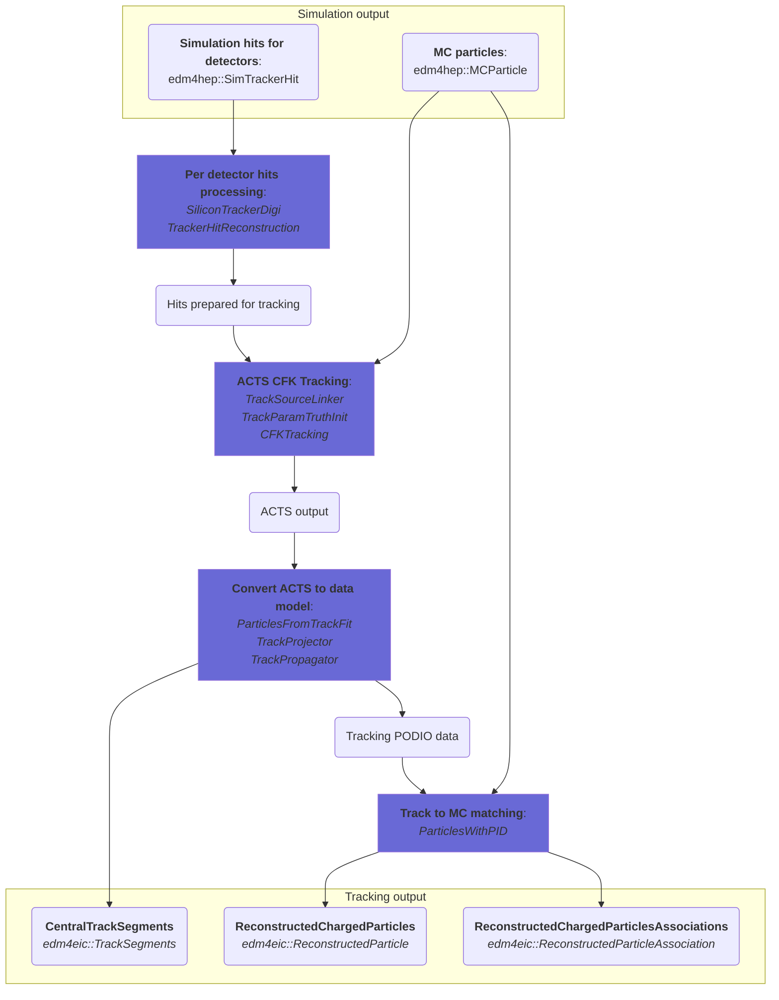

# Tracking

Simplified tracking data flows and algorithms diagram. Full diagram is described below.

### Tracking related flags:

[ACTS flags](flags/acts.md ':include')

### Reconstructed particles chart

## Full diagram

```mermaid
flowchart TB
  classDef alg fill:#f96;
  classDef col fill:#66ccff;
  subgraph Simulation output
    direction LR

    BVTXSimHits(<strong>Barrel Si vertex</strong>:<br/>VertexBarrelHits)
    BTRKSimHits(<strong>Barrel Si trk</strong>:<br/>SiBarrelHits)
    ECTRKSimHits(<strong>EndCap Si trk</strong>:<br/>TrackerEndcapHits)
    BMPGDSimHits(<strong>Barrel MPGD trk</strong>:<br/>MPGDBarrelHits)
    OBMPGDSimHits(<strong>Barrel MPGD Outer trk</strong>:<br/>OuterMPGDBarrelHits)
    ECNMPGDSimHits(<strong>Neg EndCap MPGD trk</strong>:<br/>BackwardMPGDEndcapHits)
    ECPMPGDSimHits(<strong>Pos EndCap MPGD trk</strong>:<br/>ForwardMPGDEndcapHits)
    BTOFSimHits(<strong>Barrel TOF</strong>:<br/>TOFBarrelHits)
    ECTOFSimHits(<strong>EndCap TOF</strong>:<br/>TOFEndcapHits)
  end

  BVTXSimHits --> TrackerDigi1[SiliconTrackerDigi]:::alg
  TrackerDigi1 --> VertexBarrelRawHits(SiBarrelVertexRawHits)
  VertexBarrelRawHits --> TrackerHitReconstruction1[TrackerHitReconstruction]:::alg
  TrackerHitReconstruction1 --> VertexBarrelRecHits(SiBarrelVertexRecHits)

  BTRKSimHits -->  TrackerDigi2[SiliconTrackerDigi]:::alg
  TrackerDigi2 --> TrackerBarrelRawHits(SiBarrelRawHits)
  TrackerBarrelRawHits --> TrackerHitReconstruction2[TrackerHitReconstruction]:::alg
  TrackerHitReconstruction2 --> TrackerBarrelRecHits(SiBarrelTrackerRecHits)

  ECTRKSimHits -->  TrackerDigi3[SiliconTrackerDigi]:::alg
  TrackerDigi3 --> TrackerEndcapRawHits(SiEndcapTrackerRawHits)
  TrackerEndcapRawHits --> TrackerHitReconstruction3[TrackerHitReconstruction]:::alg
  TrackerHitReconstruction3 --> TrackerEndcapRecHits(SiEndcapTrackerRecHits)

  BMPGDSimHits -->   MPGDTrackerBarrelDigi[SiliconTrackerDigi]:::alg
  MPGDTrackerBarrelDigi --> MPGDTrackerBarrelRawHits(MPGDBarrelRawHits)
  MPGDTrackerBarrelRawHits --> MPGDTrackerBarrelReconstruction[TrackerHitReconstruction]:::alg
  MPGDTrackerBarrelReconstruction --> MPGDTrackerBarrelRecHits(MPGDBarrelRecHits)

  OBMPGDSimHits -->   MPGDTrackerOutBarrelDigi[SiliconTrackerDigi]:::alg
  MPGDTrackerOutBarrelDigi --> MPGDTrackerOutBarrelRawHits(OuterMPGDBarrelRawHits)
  MPGDTrackerOutBarrelRawHits --> MPGDTrackerOutBarrelReconstruction[TrackerHitReconstruction]:::alg
  MPGDTrackerOutBarrelReconstruction --> MPGDTrackerOutBarrelRecHits(OuterMPGDBarrelRecHits)

  ECNMPGDSimHits -->   MPGDTrackerECNDigi[SiliconTrackerDigi]:::alg
  MPGDTrackerECNDigi --> MPGDTrackerECNRawHits(BackwardMPGDEndcapRawHits)
  MPGDTrackerECNRawHits --> MPGDTrackerECNReconstruction[TrackerHitReconstruction]:::alg
  MPGDTrackerECNReconstruction --> MPGDTrackerECNRecHits(BackwardMPGDEndcapRecHits)

  ECPMPGDSimHits -->   MPGDTrackerECPDigi[SiliconTrackerDigi]:::alg
  MPGDTrackerECPDigi --> MPGDTrackerECPRawHits(ForwardMPGDEndcapRawHits)
  MPGDTrackerECPRawHits --> MPGDTrackerECPReconstruction[TrackerHitReconstruction]:::alg
  MPGDTrackerECPReconstruction --> MPGDTrackerECPRecHits(ForwardMPGDEndcapRecHits)

  BTOFSimHits --> BTOFTrackerDigi[SiliconTrackerDigi]:::alg
  BTOFTrackerDigi --> BTOFRawHits(TOFBarrelRawHits)
  BTOFRawHits --> BTOFHitReconstruction[TrackerHitReconstruction]:::alg
  BTOFHitReconstruction --> BTOFRecHits(TOFBarrelRawHits)

  ECTOFSimHits --> ECTOFTrackerDigi[SiliconTrackerDigi]:::alg
  ECTOFTrackerDigi --> ECTOFRawHits(TOFEndcapRawHits)
  ECTOFRawHits --> ECTOFHitReconstruction[TrackerHitReconstruction]:::alg
  ECTOFHitReconstruction --> ECTOFRecHits(TOFEndcapRecHits)

  TrackerHitsCollector[CollectionCollector]:::alg

  VertexBarrelRecHits --> TrackerHitsCollector
  TrackerBarrelRecHits --> TrackerHitsCollector
  TrackerEndcapRecHits --> TrackerHitsCollector
  MPGDTrackerBarrelRecHits --> TrackerHitsCollector
  MPGDTrackerOutBarrelRecHits --> TrackerHitsCollector
  MPGDTrackerECNRecHits --> TrackerHitsCollector
  MPGDTrackerECPRecHits --> TrackerHitsCollector
  BTOFRecHits --> TrackerHitsCollector
  ECTOFRecHits --> TrackerHitsCollector

  TrackerHitsCollector --> CentralTrackingRecHits
  CentralTrackingRecHits --> TrackerHitsConverter[TrackerMeasurementFromHits]:::alg
  TrackerHitsConverter --> TrackerHitsOnSurface[CentralTrackerMeasurements]

  CentralTrackingRecHits --> TrackSeeding[TrackSeeding]:::alg
  TrackSeeding --> SeedParameters[CentralTrackSeedingResults]

  CKFTracking:::alg
  TrackerHitsOnSurface --> CKFTracking
  SeedParameters --> CKFTracking

  subgraph Sim output
    MCParticles(MCParticles)
  end

  MCParticles --> TrackParamTruthInit[TrackParamTruthInit]:::alg
  TrackParamTruthInit --> TrackTruthSeeds

  TrackTruthSeeds --> SubDivideCollection:::alg
  SubDivideCollection --> CentralTrackerTruthSeeds

  CKFTrackingTruthSeeded[CKFTracking]:::alg

  TrackerHitsOnSurface --> CKFTrackingTruthSeeded
  CentralTrackerTruthSeeds --> CKFTrackingTruthSeeded
  

```

This diagram illustrates data transformation and algorithms corresponding to
tracking part.

What is on the graph:

- Orange boxes - is an underlying algorithm
- Light blue boxes with rounded corners - data collection names

The flow is:

- Each detector hits first goes to **SiliconTrackerDigi** algorithm. Digitized tracking data has only geometry cell ID and timing data.
- Then each digitized hit gets into **HitReconstruction**. Geometry is found by ID, position, time and covariance extracted.
- Reconstructed hits from all detectors get to **TrackerSourceLinker** which provides measurement and linkage data for ACTS
- **CFKTracking** does fitting and produces results in ACTS classes
- **ParticlesFromTrackFit** process ACTS data and store it to PODIO edm4hep/eic data model
- **ParticlesWithPID** algorithm does track-matching with MCParticles and produce resulted `edm4eic::ReconstructedParticles` with association class
- **TrackProjection** - saves track states/points data to PODIO data model and returns CetntralTrackSegments data
