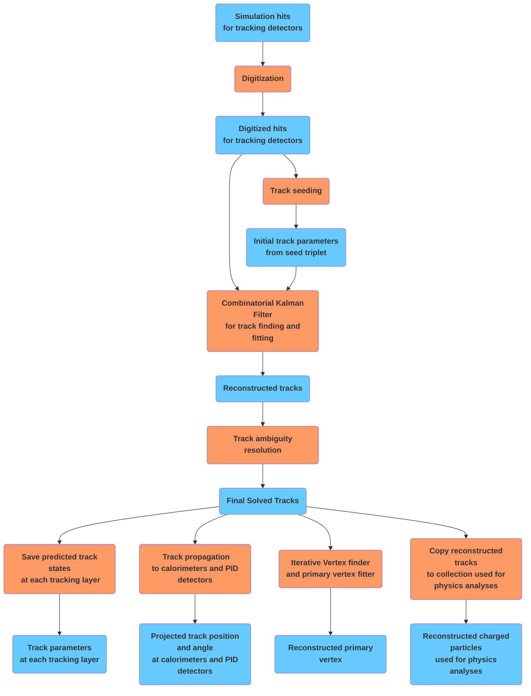
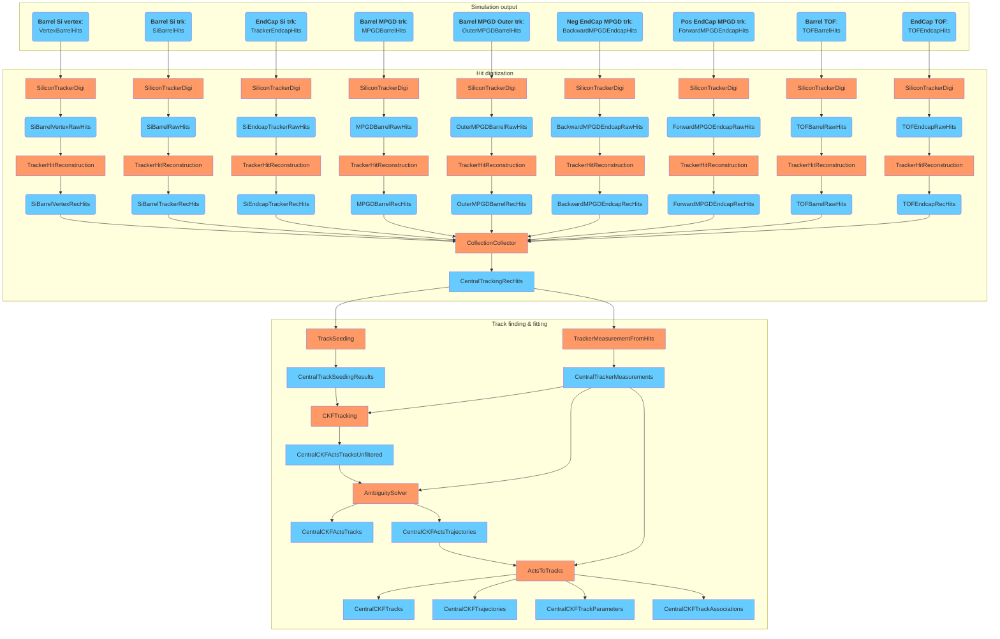
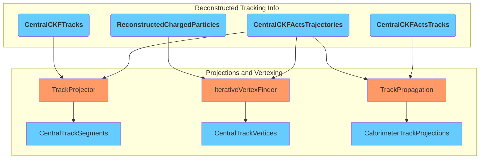
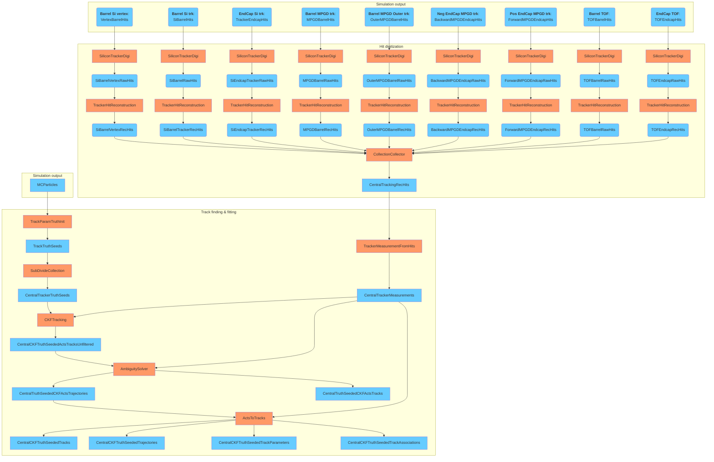

# Tracking

## Legend for workflow diagrams
- Blue boxes - data collection
- Orange boxes - factory / algorithm

## Conceptual diagram for track reconstruction

## Full diagram for track reconstruction

## Full diagram for track states, track projections, and primary vertexing

## Full diagram for idealized track reconstruction using truth seeding

## Full diagram for B0 track reconstruction
In progress...

## Description of collections
- MCParticles ([edm4hep::MCParticle](https://github.com/key4hep/EDM4hep/blob/v00-99-02/edm4hep.yaml#L230-L258)) -- Monte Carlo particle
- SimTrackerHits ([edmhep::SimTrackerHit](https://github.com/key4hep/EDM4hep/blob/v00-99-02/edm4hep.yaml#L296-L333)) -- Simulated tracker hit (e.g. VertexBarrelHits)
- RawTrackerHits ([edm4eic::RawTrackerHit](https://github.com/eic/EDM4eic/blob/v8.2.0/edm4eic.yaml#L372-L379)) -- Raw (digitized) tracker hit (e.g. SiBarrelVertexRawHits)
- TrackerHits ([edm4eic::TrackerHit](https://github.com/eic/EDM4eic/blob/v8.2.0/edm4eic.yaml#L381-L393)) -- Tracker hit reconstructed from RawTrackerHit (e.g. SiBarrelVertexRecHits, CentralTrackingRecHits)
- CentralTrackerMeasurements ([edm4eic::Measurement2D](https://github.com/eic/EDM4eic/blob/v8.2.0/edm4eic.yaml#L395-L406)) -- 2D measurement (on an arbitrary surface)
- CentralTrackSeedingResults ([edm4eic::TrackSeed](https://github.com/eic/EDM4eic/blob/v8.2.0/edm4eic.yaml#L408-L416)) -- Track seed information
- CentralCKFTracks ([edm4eic::Track](https://github.com/eic/EDM4eic/blob/v8.2.0/edm4eic.yaml#L453-L471)) -- Reconstructed track information and link to trajectory
- CentralCKFTrajectories ([edm4eic::Trajectory](https://github.com/eic/EDM4eic/blob/v8.2.0/edm4eic.yaml#L453-L471)) -- Track quality information and link to track parameters
- CentralCKFTrackParameters ([edm4eic::TrackParameters](https://github.com/eic/EDM4eic/blob/v8.2.0/edm4eic.yaml#L438-L450)] -- Reconstructed track parameters
- CentralCKFTrackAssociations ([edm4eic::MCRecoTrackParticleAssociation](https://github.com/eic/EDM4eic/blob/v8.2.0/edm4eic.yaml#L555-L564)) -- Hit-based association between reconstructed track and MCParticle
- ReconstructedChargedParticles ([edm4eic::ReconstructedParticle](https://github.com/eic/EDM4eic/blob/v8.2.0/edm4eic.yaml#L231-L263)) -- Reconstructed particle based on reconstructed track
- ReconstructedChargedParticleAssociations ([edm4eic::MCRecoParticleAssociation](https://github.com/eic/EDM4eic/blob/v8.2.0/edm4eic.yaml#L533-L542)) -- Copy of CentralCKFTrackAssociations to associate ReconstructedChargedParticle and MCParticle
- CentralTrackSegments ([edm4eic::TrackSegment](https://github.com/eic/EDM4eic/blob/v8.2.0/edm4eic.yaml#L473-L482)) -- Track segment with link to track information at various tracking detector layers ([edm4eic::TrackPoint](https://github.com/eic/EDM4eic/blob/v8.2.0/edm4eic.yaml#L159-L174))
- CentralTrackVertices ([edm4eic::Vertex](https://github.com/eic/EDM4eic/blob/v8.2.0/edm4eic.yaml#L159-L174)) -- Reconstructed primary vertex (vertices)
- CalorimeterTrackProjections ([edm4eic::TrackSegment](https://github.com/eic/EDM4eic/blob/v8.2.0/edm4eic.yaml#L473-L482)) -- Track projection at calorimeter detectors

## Acts information
- [Instructions for creating Acts Material Map](https://github.com/eic/epic/tree/main/scripts/material_map#material-map-for-acts)
- [Acts flags](flags/acts.md ':include')
