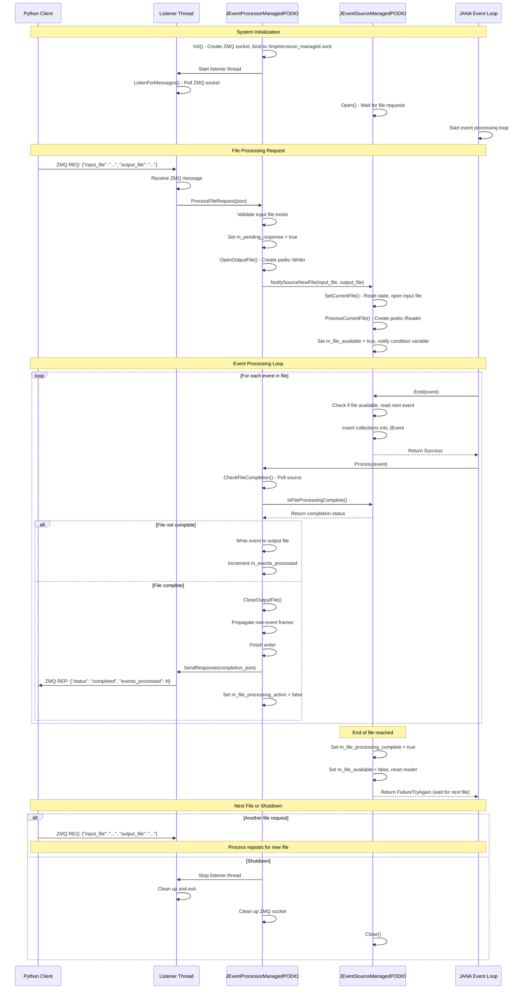

# EICrecon Managed PODIO Processing Sequence Diagram

## Key Points

1. **Initialization**: Processor creates ZMQ socket and starts listener thread. Source waits for file requests.

2. **File Request**: Client sends JSON request with input/output file paths via ZMQ REQ/REP pattern.

3. **Coordination**: Processor validates request, opens output file, then notifies source to open input file.

4. **Event Processing**: JANA event loop calls Source::Emit() to read events and Processor::Process() to write them. Processor polls source for completion status.

5. **Completion**: When source finishes reading all events, processor closes output file and sends completion response to client.

6. **Next File**: Source returns FailureTryAgain to keep JANA event loop alive, waiting for next file request.

## Communication Patterns

- **ZMQ REQ/REP**: Client ↔ Listener Thread (external communication)
- **Direct Method Calls**: Listener Thread → Processor, Processor → Source (internal coordination)
- **Polling**: Processor polls Source for completion status
- **Condition Variables**: Source uses CV to wait for new files
- **Threading**: Listener Thread runs independently, handling ZMQ communication asynchronously
