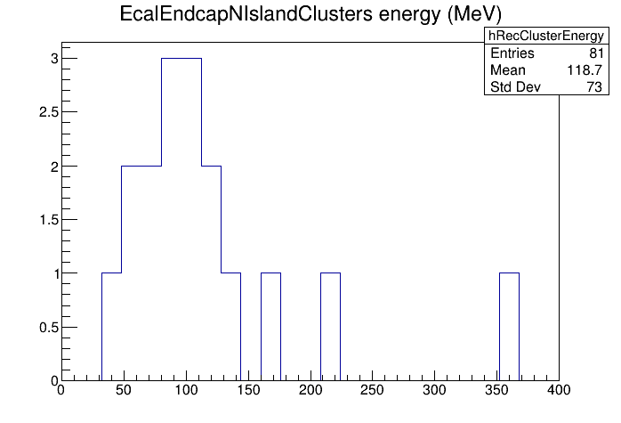

# Notice

**This section of the tutorial is outdated due to switch from `JFactory` to `JOmniFactory`. Refer to a [tutorial on reconstruction algorithms](https://eic.github.io/tutorial-reconstruction-algorithms/) for up-to-date information.**

# Adding a reconstruction algorithm to EICrecon

In JANA, algorithms are kept in `JFactory` classes. These are the classes that
interact with the JANA framework to match requests for certain objects or
collections with the algorithm that produces them.


## Creating a new factory
For this example, we will create a factory that takes reconstructed
`edm4eic::ProtoCluster` objects from the collection `EcalEndcapNIslandProtoClusters`
and will create objects of type `edm4eic::Cluster` with collection name
`EcalEndcapNIslandClusters`.

To start with, create a file in the `EICrecon` source tree called:
~~~
src/detectors/EEMC/Cluster_factory_EcalEndcapNIslandClusters.h
~~~
Edit the file to have these contents:

```cpp
#pragma once

#include <cmath>

#include <JANA/JEvent.h>
#include <JANA/JFactoryT.h>
#include <edm4eic/ClusterCollection.h>
#include <edm4eic/ProtoClusterCollection.h>

class Cluster_factory_EcalEndcapNIslandClusters : public JFactoryT<edm4eic::Cluster> {
public:
    //------------------------------------------
    // Constructor
    Cluster_factory_EcalEndcapNIslandClusters(){
        SetTag("EcalEndcapNIslandClusters");
    }

    //------------------------------------------
    // Init
    void Init() override{
        auto m_app = GetApplication();

        // This is an example of how to declare a configuration parameter that
        // can be set at run time. e.g. with -PEEMC:EcalEndcapNIslandClusters:scaleFactor=0.97
        m_scaleFactor =0.98;
        m_app->SetDefaultParameter("EEMC:EcalEndcapNIslandClusters:scaleFactor", m_scaleFactor, "Energy scale factor");
    }

    //------------------------------------------
    // Process
    void Process(const std::shared_ptr<const JEvent> &event) override{

        // Grab inputs
        const auto &protoclusters = *static_cast<const edm4eic::ProtoClusterCollection*>(event->GetCollectionBase("EcalEndcapNIslandProtoClusters"));

        // Loop over protoclusters and turn each into a cluster
        std::vector<edm4eic::Cluster*> outputClusters;
        for( auto proto : protoclusters ) {

            // Fill cumulative values by looping over all hits in proto cluster
            float energy = 0;
            double energyError_squared = 0.0;
            float time = 1.0E8;
            float timeError;
            edm4hep::Vector3f position;
            double sum_weights = 0.0;
            for( uint32_t ihit=0; ihit<proto.hits_size() ; ihit++){
                auto const &hit = proto.getHits(ihit);
                auto weight = proto.getWeights(ihit);
                energy += hit.getEnergy();
                energyError_squared += std::pow(hit.getEnergyError(), 2.0);
                if( hit.getTime() < time ){
                    time = hit.getTime();            // use earliest time
                    timeError = hit.getTimeError();  // use error of earliest time
                }
                auto &p = hit.getPosition();
                position.x += p.x*weight;
                position.y += p.y*weight;
                position.z += p.z*weight;
                sum_weights += weight;
            }

            // Normalize position
            position.x /= sum_weights;
            position.y /= sum_weights;
            position.z /= sum_weights;

            // Create a cluster object from values accumulated from hits above
            auto cluster = new edm4eic::Cluster(
                0, // type (?))
                energy * m_scaleFactor,
                sqrt(energyError_squared),
                time,
                timeError,
                proto.hits_size(),
                position,

                // Not sure how to calculate these last few
                edm4eic::Cov3f(), // positionError,
                0.0, // intrinsicTheta,
                0.0, // intrinsicPhi,
                edm4eic::Cov2f() // intrinsicDirectionError
                );

            outputClusters.push_back( cluster );
        }

        // Hand ownership of algorithm objects over to JANA
        Set(outputClusters);
    }

private:
    float m_scaleFactor;
};
```

For the above algorithm to be available in JANA to other factories or plugins,
you will need to add a `JFactoryGeneratorT` object for it. Do this by editing
the file named for the source directory in which it resides. In this example,
because the above file will live in _src/detectors/EEMC_, edit the file
__src/detectors/EEMC/EEMC.cc_. It should look something like the following where
the last `include` line and the last _app->Add(...)_ line have been added to
declare the new factory.

```cpp
// Copyright 2022, David Lawrence
// Subject to the terms in the LICENSE file found in the top-level directory.
//
//

#include <JANA/JApplication.h>
#include <JANA/JFactoryGenerator.h>


#include "RawCalorimeterHit_factory_EcalEndcapNRawHits.h"
#include "CalorimeterHit_factory_EcalEndcapNRecHits.h"
#include "ProtoCluster_factory_EcalEndcapNTruthProtoClusters.h"
#include "ProtoCluster_factory_EcalEndcapNIslandProtoClusters.h"
#include "Cluster_factory_EcalEndcapNClusters.h"
#include "Cluster_factory_EcalEndcapNMergedClusters.h"
#include "Cluster_factory_EcalEndcapNIslandClusters.h"

extern "C" {
    void InitPlugin(JApplication *m_app) {
        InitJANAPlugin(m_app);
        m_app->Add(new JFactoryGeneratorT<RawCalorimeterHit_factory_EcalEndcapNRawHits>());
        m_app->Add(new JFactoryGeneratorT<CalorimeterHit_factory_EcalEndcapNRecHits>());
        m_app->Add(new JFactoryGeneratorT<ProtoCluster_factory_EcalEndcapNTruthProtoClusters>());
        m_app->Add(new JFactoryGeneratorT<ProtoCluster_factory_EcalEndcapNIslandProtoClusters>());
        m_app->Add(new JFactoryGeneratorT<Cluster_factory_EcalEndcapNClusters>());
        m_app->Add(new JFactoryGeneratorT<Cluster_factory_EcalEndcapNMergedClusters>());
        m_app->Add(new JFactoryGeneratorT<Cluster_factory_EcalEndcapNIslandClusters>());
    }
}
```

## Testing the new factory

Add these lines in your plugin:

```cpp
// Place this at the top of the processor header file (e.g. DaveTestProcessor.h)
#include <edm4eic/Cluster.h>

// Place this in the body of the class definition of the processor header file
TH1D* hRecClusterEnergy = nullptr;

// Place this in the InitWithGlobalRootLock() method in the processor implementation
// file (e.g. DaveTestProcessor.cc)
hRecClusterEnergy  = new TH1D("hRecClusterEnergy",  "EcalEndcapNIslandClusters energy (MeV)",  250, 0.0, 400.0);

// Place this in the ProcessSequential method of the same file
const auto &clusters = *static_cast<const edm4eic::ClusterCollection*>(event->GetCollectionBase("EcalEndcapNIslandClusters"));
for (auto cluster : clusters) hRecClusterEnergy->Fill(cluster.getEnergy() / dd4hep::MeV);
```

Run some events through and have a look at the result. Here is what this looks like
for the file:
[https://eicaidata.s3.amazonaws.com/2022-09-04_pgun_e-_podio-0.15_edm4hep-0.6_0-30GeV_alldir_1k.edm4hep.root]()



## Generic algorithms
For EPIC, we have as a goal to use generic algorithms that are framework unaware.
Thus, for these algorithms the _JFactory_ classes will serve as a layer to JANA
for these generic algorithm classes.

At this point in time, the generic algorithms that `EICrecon` uses are being kept in the
`EICrecon` repository. Work is ongoing in a separate repository that is
planned to host these in the future, but that is being deferred until after the
initial simulation campaign.

To see an example of how a generic algorithm is being implemented, look at these
files:


[src/detectors/EEMC/RawCalorimeterHit_factory_EcalEndcapNRawHits.h]()<br/>
[src/algorithms/calorimetry/CalorimeterHitDigi.h]()<br/>
[src/algorithms/calorimetry/CalorimeterHitDigi.cc]()<br/>


Using generic algorithms requires additional classes and so makes things
slightly more complex. However, the generic algorithms can be recycled
for use in multiple detector systems which adds some simplification.
