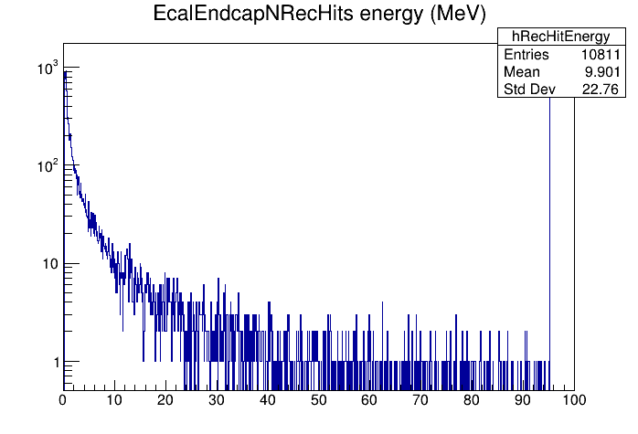

# JANA plugins in EICrecon

Here are instructions for creating your own user plugin that can create
custom histograms/trees that will be added to the output ROOT histograms
file. This covers just the most common use-case of making a plugin with
a _JEventProcessor_.

These instructions can be used to build a plugin that is kept outside of
the `EICrecon` source tree, but that compiles against it. Thus, if you have
access to a read-only `EICrecon` build, you can still use it to make a plugin
that can install to a directory you do have write access to.

## EICrecon_MY
The `EICrecon_MY` environment variable is useful for building plugins outside
the `EICrecon` source tree. Set this to a directory where you have write
permission. The build instructions below will install the plugin to that
directory. When `eicrecon` is run, it will also look for plugins in the
`$EICrecon_MY` directory (as well as the central `EICrecon` build you are using.)

~~~bash
mkdir EICrecon_MY
export EICrecon_MY=${PWD}/EICrecon_MY
~~~


## Creating a plugin with _eicmkplugin.py_
EICrecon installs a script called _eicmkplugin.py_ that will generate all
of the boilerplate code for a new plugin. This includes a directory, a
_CMakeLists.txt_ file, and some skeleton code. The instructions below create
a plugin called _DaveTest_ and then compile it. It will be installed in
the directory pointed to by your `EICrecon_MY` environment variable (if set).

~~~bash
eicmkplugin.py DaveTest
cmake -S DaveTest -B DaveTest/build
cmake --build DaveTest/build --target install
~~~

You can test that the plugin installed and can load correctly by running
`eicrecon` with it.

~~~bash
eicrecon -Pplugins=DaveTest,JTest -Pjana:nevents=10
~~~

<details>
    <summary>Click here to see full output of above command</summary>

~~~
     ____      _     ___      ___       _
     `MM'     dM.    `MM\     `M'      dM.
      MM     ,MMb     MMM\     M      ,MMb
      MM     d'YM.    M\MM\    M      d'YM.      ____
      MM    ,P `Mb    M \MM\   M     ,P `Mb     6MMMMb
      MM    d'  YM.   M  \MM\  M     d'  YM.   MM'  `Mb
      MM   ,P   `Mb   M   \MM\ M    ,P   `Mb        ,MM
      MM   d'    YM.  M    \MM\M    d'    YM.      ,MM'
(8)   MM  ,MMMMMMMMb  M     \MMM   ,MMMMMMMMb    ,M'
((   ,M9  d'      YM. M      \MM   d'      YM. ,M'
 YMMMM9 _dM_     _dMM_M_      \M _dM_     _dMM_MMMMMMMM

[INFO] Creating pipe named "/tmp/jana_status" for status info.
[INFO] Setting signal handlers
[INFO] JPluginLoader: Initializing plugin "/work/eic2/users/davidl/2022.08.29.eic-shell/EICwork/EICrecon_MY/plugins/DaveTest.so"
[INFO] JPluginLoader: Initializing plugin "/usr/local/plugins/JTest.so"
[INFO] JPluginLoader: Initializing plugin "/w/eic-scshelf2104/users/davidl/2022.08.29.eic-shell/EICwork/EICrecon/lib/EICrecon/plugins/podio.so"
[INFO] JPluginLoader: Initializing plugin "/w/eic-scshelf2104/users/davidl/2022.08.29.eic-shell/EICwork/EICrecon/lib/EICrecon/plugins/dd4hep.so"
[INFO] JPluginLoader: Initializing plugin "/w/eic-scshelf2104/users/davidl/2022.08.29.eic-shell/EICwork/EICrecon/lib/EICrecon/plugins/acts.so"
[INFO] JPluginLoader: Initializing plugin "/w/eic-scshelf2104/users/davidl/2022.08.29.eic-shell/EICwork/EICrecon/lib/EICrecon/plugins/log.so"
[INFO] JPluginLoader: Initializing plugin "/w/eic-scshelf2104/users/davidl/2022.08.29.eic-shell/EICwork/EICrecon/lib/EICrecon/plugins/rootfile.so"
[INFO] JPluginLoader: Initializing plugin "/w/eic-scshelf2104/users/davidl/2022.08.29.eic-shell/EICwork/EICrecon/lib/EICrecon/plugins/BEMC.so"
[INFO] JPluginLoader: Initializing plugin "/w/eic-scshelf2104/users/davidl/2022.08.29.eic-shell/EICwork/EICrecon/lib/EICrecon/plugins/EEMC.so"
[INFO] JArrowProcessingController: NUMA Configuration

  Affinity strategy: compute-bound (favor fewer hyperthreads)
  Locality strategy: global
  Location count: 1
  +--------+----------+-------+--------+-----------+--------+
  | worker | location |  cpu  |  core  | numa node | socket |
  +--------+----------+-------+--------+-----------+--------+
  |      0 |        0 |     0 |      0 |         0 |      0 |
  |      1 |        0 |     1 |      1 |         0 |      0 |
  |      2 |        0 |     2 |      2 |         0 |      0 |
  |      3 |        0 |     3 |      3 |         1 |      0 |
  |      4 |        0 |     4 |      4 |         1 |      0 |
  |      5 |        0 |     5 |      5 |         0 |      0 |
  |      6 |        0 |     6 |      6 |         0 |      0 |
  |      7 |        0 |     7 |      7 |         1 |      0 |
  |      8 |        0 |     8 |      8 |         1 |      0 |
  |      9 |        0 |     9 |      9 |         1 |      0 |
  |     10 |        0 |    10 |     10 |         0 |      0 |
  |     11 |        0 |    11 |     11 |         0 |      0 |
  |     12 |        0 |    12 |     12 |         0 |      0 |
  |     13 |        0 |    13 |     13 |         1 |      0 |
  |     14 |        0 |    14 |     14 |         1 |      0 |
  |     15 |        0 |    15 |     15 |         0 |      0 |
  |     16 |        0 |    16 |     16 |         0 |      0 |
  |     17 |        0 |    17 |     17 |         1 |      0 |
  |     18 |        0 |    18 |     18 |         1 |      0 |
  |     19 |        0 |    19 |     19 |         1 |      0 |
  |     20 |        0 |    20 |     20 |         2 |      1 |
  |     21 |        0 |    21 |     21 |         2 |      1 |
  |     22 |        0 |    22 |     22 |         2 |      1 |
  |     23 |        0 |    23 |     23 |         3 |      1 |
  |     24 |        0 |    24 |     24 |         3 |      1 |
  |     25 |        0 |    25 |     25 |         2 |      1 |
  |     26 |        0 |    26 |     26 |         2 |      1 |
  |     27 |        0 |    27 |     27 |         3 |      1 |
  |     28 |        0 |    28 |     28 |         3 |      1 |
  |     29 |        0 |    29 |     29 |         3 |      1 |
  |     30 |        0 |    30 |     30 |         2 |      1 |
  |     31 |        0 |    31 |     31 |         2 |      1 |
  |     32 |        0 |    32 |     32 |         2 |      1 |
  |     33 |        0 |    33 |     33 |         3 |      1 |
  |     34 |        0 |    34 |     34 |         3 |      1 |
  |     35 |        0 |    35 |     35 |         2 |      1 |
  |     36 |        0 |    36 |     36 |         2 |      1 |
  |     37 |        0 |    37 |     37 |         3 |      1 |
  |     38 |        0 |    38 |     38 |         3 |      1 |
  |     39 |        0 |    39 |     39 |         3 |      1 |
  |     40 |        0 |    40 |      0 |         0 |      0 |
  |     41 |        0 |    41 |      1 |         0 |      0 |
  |     42 |        0 |    42 |      2 |         0 |      0 |
  |     43 |        0 |    43 |      3 |         1 |      0 |
  |     44 |        0 |    44 |      4 |         1 |      0 |
  |     45 |        0 |    45 |      5 |         0 |      0 |
  |     46 |        0 |    46 |      6 |         0 |      0 |
  |     47 |        0 |    47 |      7 |         1 |      0 |
  |     48 |        0 |    48 |      8 |         1 |      0 |
  |     49 |        0 |    49 |      9 |         1 |      0 |
  |     50 |        0 |    50 |     10 |         0 |      0 |
  |     51 |        0 |    51 |     11 |         0 |      0 |
  |     52 |        0 |    52 |     12 |         0 |      0 |
  |     53 |        0 |    53 |     13 |         1 |      0 |
  |     54 |        0 |    54 |     14 |         1 |      0 |
  |     55 |        0 |    55 |     15 |         0 |      0 |
  |     56 |        0 |    56 |     16 |         0 |      0 |
  |     57 |        0 |    57 |     17 |         1 |      0 |
  |     58 |        0 |    58 |     18 |         1 |      0 |
  |     59 |        0 |    59 |     19 |         1 |      0 |
  |     60 |        0 |    60 |     20 |         2 |      1 |
  |     61 |        0 |    61 |     21 |         2 |      1 |
  |     62 |        0 |    62 |     22 |         2 |      1 |
  |     63 |        0 |    63 |     23 |         3 |      1 |
  |     64 |        0 |    64 |     24 |         3 |      1 |
  |     65 |        0 |    65 |     25 |         2 |      1 |
  |     66 |        0 |    66 |     26 |         2 |      1 |
  |     67 |        0 |    67 |     27 |         3 |      1 |
  |     68 |        0 |    68 |     28 |         3 |      1 |
  |     69 |        0 |    69 |     29 |         3 |      1 |
  |     70 |        0 |    70 |     30 |         2 |      1 |
  |     71 |        0 |    71 |     31 |         2 |      1 |
  |     72 |        0 |    72 |     32 |         2 |      1 |
  |     73 |        0 |    73 |     33 |         3 |      1 |
  |     74 |        0 |    74 |     34 |         3 |      1 |
  |     75 |        0 |    75 |     35 |         2 |      1 |
  |     76 |        0 |    76 |     36 |         2 |      1 |
  |     77 |        0 |    77 |     37 |         3 |      1 |
  |     78 |        0 |    78 |     38 |         3 |      1 |
  |     79 |        0 |    79 |     39 |         3 |      1 |
  +--------+----------+-------+--------+-----------+--------+

[INFO] Configuration Parameters
  ----------------------------
      Name          Value
  ------------  --------------
  csv:dest_dir  .
  jana:nevents  10
       plugins  DaveTest,JTest
  ----------------------------

[INFO] Component Summary

  SOURCES
  -----------------------------------
   Plugin      Name         Source
  --------  -----------  ------------
  JTest.so  JTestParser  dummy_source
  -----------------------------------
  PROCESSORS
  ---------------------------------------
    Plugin                Name
  -----------  --------------------------
  DaveTest.so  DaveTestProcessor
  JTest.so     JTestPlotter
  JTest.so     JCsvWriter<JTestTrackData>
  ---------------------------------------
  FACTORIES
  --------------------------------------------------------------------
   Plugin          Object name                       Tag
  --------  --------------------------  ------------------------------
  JTest.so  JTestEventData
  JTest.so  JTestTrackData
  EEMC.so   edm4eic::ProtoCluster       EcalEndcapNIslandProtoClusters
  EEMC.so   edm4eic::ProtoCluster       EcalEndcapNTruthProtoClusters
  EEMC.so   edm4eic::CalorimeterHit     EcalEndcapNRecHits
  EEMC.so   edm4eic::Cluster            EcalEndcapNClusters
  EEMC.so   edm4eic::Cluster            EcalEndcapNMergedClusters
  BEMC.so   edm4hep::RawCalorimeterHit  EcalBarrelNRawHits
  EEMC.so   edm4hep::RawCalorimeterHit  EcalEndcapNRawHits
  --------------------------------------------------------------------

[INFO] Starting processing with 1 threads requested...
[INFO] JArrowProcessingController: run(): Launching 1 workers
[INFO] JArrow: Initializing JEventProcessor 'DaveTestProcessor'
[INFO] JArrow: Initializing JEventProcessor 'JTestPlotter'
[INFO] JArrow: Initializing JEventProcessor 'JCsvWriter<JTestTrackData>'
[INFO] JArrow: Initializing JEventSource 'dummy_source' (JTestParser)
[INFO] Status: 5 events processed  10.0 Hz (10.0 Hz avg)
[INFO] JArrow: Finalizing JEventSource 'dummy_source' (JTestParser)
[INFO] Status: 10 events processed  13.2 Hz (11.4 Hz avg)
[INFO] All workers have stopped.
[INFO] Merging threads ...
[INFO] JArrow: Finalizing JEventProcessor 'DaveTestProcessor'
[INFO] JArrow: Finalizing JEventProcessor 'JTestPlotter'
[INFO] JArrow: Finalizing JEventProcessor 'JCsvWriter<JTestTrackData>'
[INFO] Event processing ended.
[INFO] JArrowProcessingController: Final Report
  Thread team size [count]:    1
  Total uptime [s]:            0.8802
  Uptime delta [s]:            0.3781
  Completed events [count]:    10
  Inst throughput [Hz]:        13.2
  Avg throughput [Hz]:         11.4
  Sequential bottleneck [Hz]:  212
  Parallel bottleneck [Hz]:    12.1
  Efficiency [0..1]:           0.94

  +--------------------------+------------+--------+-----+---------+-------+--------+---------+-------------+
  |           Name           |   Status   |  Type  | Par | Threads | Chunk | Thresh | Pending |  Completed  |
  +--------------------------+------------+--------+-----+---------+-------+--------+---------+-------------+
  | dummy_source             | Finished   | Source |  F  |       0 |    40 |      - |       - |          10 |
  | processors               | Finished   | Sink   |  T  |       0 |     1 |     80 |       0 |          10 |
  +--------------------------+------------+--------+-----+---------+-------+--------+---------+-------------+
  +--------------------------+-------------+--------------+----------------+--------------+----------------+
  |           Name           | Avg latency | Inst latency | Queue latency  | Queue visits | Queue overhead |
  |                          | [ms/event]  |  [ms/event]  |   [ms/visit]   |    [count]   |     [0..1]     |
  +--------------------------+-------------+--------------+----------------+--------------+----------------+
  | dummy_source             |        4.73 |         3.16 |       0.000174 |           11 |       4.05e-05 |
  | processors               |        82.8 |         88.4 |       0.000324 |           50 |       1.96e-05 |
  +--------------------------+-------------+--------------+----------------+--------------+----------------+
  +----+----------------------+-------------+------------+-----------+----------------+------------------+
  | ID | Last arrow name      | Useful time | Retry time | Idle time | Scheduler time | Scheduler visits |
  |    |                      |     [ms]    |    [ms]    |    [ms]   |      [ms]      |     [count]      |
  +----+----------------------+-------------+------------+-----------+----------------+------------------+
  |  0 | idle                 |      0.0357 |          0 |         0 |       0.000538 |               21 |
  +----+----------------------+-------------+------------+-----------+----------------+------------------+

~~~
</details>

Note that in the above command, a second plugin _JTest_ which supplies dummy events and
the _jana_nevents_ configuration parameter is set to only process 10 events.

For the plugin to be useful, you will need to edit the files in the `DaveTest`
directory. There are two files: _DaveTestProcessor.cc_ and a _DaveTestProcessor.h_.
Start with the _DaveTestProcessor.h_ file. Edit your file to look similar to the one
below. You will need to add include lines for each data type you are interested
in (see ```#include <edm4hep/Cluster.h>```), a Prefetch line for each collection
type, and then pointer for every histogram or tree you wish to create.

```cpp
#include <JANA/JEventProcessorSequentialRoot.h>
#include <TH2D.h>
#include <TFile.h>

#include <edm4hep/Cluster.h>

class DaveTestProcessor: public JEventProcessorSequentialRoot {
private:

    // Data objects we will need from JANA e.g.
    PrefetchT<edm4hep::Cluster> clusters   = {this, "EcalEndcapNClusters"};

    // Declare histogram and tree pointers here. e.g.
    TH1D* hClusterEnergy = nullptr;

public:
    DaveTestProcessor() { SetTypeName(NAME_OF_THIS); }

    void InitWithGlobalRootLock() override;
    void ProcessSequential(const std::shared_ptr<const JEvent>& event) override;
    void FinishWithGlobalRootLock() override;
};
```
Next, edit the _DaveTest.cc_ file to look similar to what is below. The key things
you will need to add are the lines in the `InitWithGlobalRootLock` and
`ProcessSequential` methods. See the comments in the`InitWithGlobalRootLock`
method for an explanation of those.

The one line in the `ProcessSequential` method will loop over the values
in the `clusters` member. As a `Prefetch` object, _JANA_ will automatically
call all agorithms needed to produce the `Cluster` objects prior to calling
`ProcessSequential`. This works for objects created by algorithms or ones
coming straight from the file.

```cpp
#include "DaveTestProcessor.h"
#include <services/rootfile/RootFile_service.h>

// The following just makes this a JANA plugin
extern "C" {
    void InitPlugin(JApplication *m_app) {
        InitJANAPlugin(m_app);
        m_app->Add(new DaveTestProcessor);
    }
}

//-------------------------------------------
// InitWithGlobalRootLock
//-------------------------------------------
void DaveTestProcessor::InitWithGlobalRootLock(){

    // This ensures the histograms created here show up in the same root file as
    // other plugins attached to the process. Place them in dedicated directory
    // to avoid name conflicts.
    auto rootfile_svc = GetApplication()->GetService<RootFile_service>();
    auto rootfile = rootfile_svc->GetHistFile();
    rootfile->mkdir("DaveTest")->cd();

    hClusterEnergy  = new TH1D("hClusterEnergy",  "EcalEndcapNClusters energy (GeV)",  200, 0, 0.075);
}

//-------------------------------------------
// ProcessSequential
//-------------------------------------------
void DaveTestProcessor::ProcessSequential(const std::shared_ptr<const JEvent>& event) {

     for( auto cluster : clusters() ) hClusterEnergy->Fill(  cluster->getEnergy() );
}

//-------------------------------------------
// FinishWithGlobalRootLock
//-------------------------------------------
void DaveTestProcessor::FinishWithGlobalRootLock() {

    // Do any final calculations here.
}
```

You can now test this using you favorite simulated data file or with the one in the
following commands:

~~~bash
wget https://eicaidata.s3.amazonaws.com/2022-09-04_pgun_e-_podio-0.15_edm4hep-0.6_0-30GeV_alldir_1k.edm4hep.root
eicrecon -Pplugins=DaveTest 2022-09-04_pgun_e-_podio-0.15_edm4hep-0.6_0-30GeV_alldir_1k.edm4hep.root
~~~

This should run through the events filling you histogram resulting in the file
`eicrecon.root`. The histogram should look something like this:




## Manually creating a plugin
For people who really love to get their fingers dirty and feel the above
instructions are just too easy, here are some more detailed instructions
for creating a plugin from scratch without `eicmkplugin.py`.

There is a copy/paste CMake file that should automatically create plugin out of sources.

- plugin name is taken from a directory name
- there should be /</plugin name/>/.cc file with `void InitPlugin(JApplication *m_app)` function


### Create a plugin:

E.g. if you want to create a plugin named `my_plugin`

- Create a directory `my_plugin`
- Create a file `my_plugin.cc` which will have `InitPlugin` function
- Create `CMakeLists.txt` with the content below
- Add all others files (cmake GLOB is used)

### Recommended cmake:

Recommended CMake for a plugin:

```cmake
cmake_minimum_required(VERSION 3.16)

# Automatically set plugin name the same as the direcotry name
# Don't forget string(REPLACE " " "_" PLUGIN_NAME ${PLUGIN_NAME}) if this dir has spaces in its name
get_filename_component(PLUGIN_NAME ${CMAKE_CURRENT_LIST_DIR} NAME)

# Function creates ${PLUGIN_NAME}_plugin and ${PLUGIN_NAME}_library targets
# Setting default includes, libraries and installation paths
plugin_add(${PLUGIN_NAME})

# Find dependencies
find_package(JANA REQUIRED)
find_package(EDM4HEP REQUIRED)
find_package(podio REQUIRED)
find_package(DD4hep REQUIRED)
find_package(ROOT REQUIRED COMPONENTS Core Tree Hist RIO EG)

# The macro grabs sources as *.cc *.cpp *.c and headers as *.h *.hh *.hpp
# Then correctly sets sources for ${_name}_plugin and ${_name}_library targets
# Adds headers to the correct installation directory
plugin_glob_all(${PLUGIN_NAME})

# Add include directories
# (same as target_include_directories but for both plugin and library)
plugin_include_directories(${PLUGIN_NAME} SYSTEM PUBLIC ${JANA_INCLUDE_DIR} ${podio_INCLUDE_DIR} ${EDM4HEP_INCLUDE_DIR} ${DD4hep_INCLUDE_DIRS} ${ROOT_INCLUDE_DIRS})

# Add libraries
# (same as target_include_directories but for both plugin and library)
plugin_link_libraries(${PLUGIN_NAME} ${JANA_LIB})
```

### CMake macros:

There are `plugin_...` macros that are slim wrappers trying to minimize an amount of boilerplate
code of each plugin cmake scripts. Macros mimic CMake functions like `target_link_libraries` => `plugin_link_libraries`.
