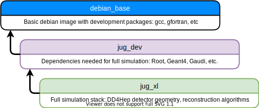

# Containers

## Overview

The containers are released both for docker and singularity. Singularity images are automatically propagated to CVMFS:

- [Containers repository](https://eicweb.phy.anl.gov/containers)
- [Docker Hub](https://hub.docker.com/u/eicweb)
- CVMFS path (available at BNL and JLab):
  ```
  singularity run /cvmfs/singularity.opensciencegrid.org/eicweb/jug_xl:nightly
  ```

### Images structure:




- **debian_base** - is a container generic base container based on amd64/debian:testing
- **jug_dev** - have all major HENP packages such as ROOT, Geant4 and DD4HEP but without detector and reconstruction. The image is used for testing purposes and automation.
- **jug_xl** - intended to be used to run simulation and work on detectors for users. jug_dev + full simulation packages


### Versioning:


- **nightly** - recreated every night, using master branches
- **testing** - recreated every night, using fixed versions
- **4.0-stable** - the latest stable version from 4.0 branch
- **4.0.0** - exact tagged version


Nightly and testing are different in that nightly uses the master branch of the software, while testing uses
whatever version is given at the top of the [gitlab-ci.yml](https://eicweb.phy.anl.gov/containers/eic_container/-/blob/master/.gitlab-ci.yml#L68).
So testing is the precursor to the next release version.


**TL;DR;**

Now it is recommended to use: ```eicweb/jug_xl:nightly```


## Run in docker

Containers are available at eicweb namespace at
[the dockerhub](https://hub.docker.com/u/eicweb)

To download or update the container:

```bash
docker pull eicweb/jug_xl:nightly
```

Running docker (minimal and probably useless):

```bash
docker run -it --rm eicweb/jug_xl:nightly
```


```--rm``` flag Docker **automatically cleans up the container** and remove the file system
**when the container exits**. We use --rm flag for the sake of the tutorial repeatability. **If you work with the container,
might be, you don't need it** (read more below).

```-it``` flag enables interactive session. Without this flag ctrl+c will not work on Mac
machines. In general `-it` is used to run e.g. bash session (see below)


Each time `docker run` command is called, it spawns a new container.
In particular, it first creates a writeable container layer over the
specified image, and then starts it using the specified command. If `--rm` flag is not used,
a stopped container can be restarted with all its previous changes intact using `docker start` command.
Docker works somehow like tmux or screen - you can reconnect to the running image,
attach many bash shells and even if container is stopped you can start it again and reconnect.
This makes debugging easier, and you retain all your data. But `--rm` flag good for repeatability.

**Related docker documentation:**


- [Docker run](https://docs.docker.com/engine/reference/commandline/run/)
- [Docker start](https://docs.docker.com/engine/reference/commandline/start/)
- [--rm flag](https://docs.docker.com/engine/reference/run/#clean-up---rm)


## Select detector

The environment is set up with defaults, so you can use all the programs
in the container as usual and assume everything needed to run the included software
is already setup. But the detector needs to be selected for use with
simulation or reconstruction:

```bash
# Detectors live in
# /opt/detectors
# one can select particular configuration as
# source /opt/detector/epic-22.10.0/setup.sh
#
# or one can set the default detector (now points to epic-nightly)
source /opt/detector/setup.sh
```


## Bind directories

You can bind any directory on your system to docker image by using **-v** flag:

```
-v <your/directory>:<docker/directory>
```

Convenient place inside docker image is `/mnt/` directory. Full example:

```bash
docker run -it -v /home/user/eic/data:/mnt/data --rm eicweb/jug_xl:nightly
ls /mnt/data
```

**Related docker documentation:**

- [Docker bind](https://docs.docker.com/storage/bind-mounts/)
- [Storage](https://docs.docker.com/storage/) (other mechanisms of how to manage data in docker)


## Code debugging

**Debugging** : To do C++ debugging (run GDB or so) one has to specify additional flags
(the debugging is switched off by docker by default for security reasons):

```--cap-add=SYS_PTRACE --security-opt seccomp=unconfined```

With debugging enabled and all ports open:

```
docker run -it --rm --cap-add=SYS_PTRACE --security-opt seccomp=unconfined eicweb/jug_xl:nightly
```


## Docker in IDEs

It might be a very convenient to use development tools (IDE's, debuggers, etc.)
installed on your system, while using the docker to build, run and debug the code.
The setup depends on particular tool:

- [Visual Studio Code docker remote debugging](https://code.visualstudio.com/docs/remote/remote-overview)
- [CLion docker toolchain](https://www.jetbrains.com/help/clion/clion-toolchains-in-docker.html)

> Use `\usr\local\bin\cmake` as cmake path, when configuring IDEs with jug_xl image


## X11 - Working with GUI

To use X11 directly require x11 client apps on Macs and Windows
and may have some issues with user id's and permissions on Posix (max & linux).
It might look complex, but actually it is not that bad and works most of the time.


**Requirements**: X11 clients (windows and mac), additional docker flags (see of each OS)

You can use X11 natively (as natively as possible) with this docker image in your system:

### Linux

To use graphics, make sure you are in an X11 session and run the following command:

```bash
docker run -e DISPLAY=$DISPLAY -v /tmp/.X11-unix:/tmp/.X11-unix --rm -it --user $(id -u) eicweb/jug_xl:nightly
```

There might be issues with user id on systems like JLab farms.

### Windows

To enable graphics, you must have [VcXsrv](https://sourceforge.net/projects/vcxsrv/files/latest/download) installed.
Make sure VcXsrv is whitelisted in the Windows firewall when prompted.

Start VcXsrv with 'allow from any origin' flag

```bash
docker run --rm -it -e LIBGL_ALWAIS_INDIRECT=1 -e DISPLAY=10.0.75.1:0 eicweb/jug_xl:nightly
```

> 10.0.75.1 address corresponds to the network configuration in docker settings


### OSX

To use graphics on OSX, make sure XQuarz is installed.
After installing, open XQuartz, and go to XQuartz, Preferences, select the Security tab, and tick the box
"Allow connections from network clients". Then exit XQuarz.

Afterwards, open a terminal and run the following commands:

```bash
ip=$(ifconfig en0 | grep inet | awk '$1=="inet" {print $2}')

echo $ip   # To make sure it was successful
           # If nothing is displayed, replace en0 with en1 and so on

xhost + $ip  # start XQuartz and whitelist your local IP address

```

This will start XQuartz and whitelist your local IP address.

Finally, you can start up docker with the following command:

```
docker run --rm -it -v /tmp/.X11-unix:/tmp/.X11-unix -e DISPLAY=$ip:0 eicweb/jug_xl:nightly
```


## Inherit image

If using this container as a basis for a new container, you can direct access
the full container environment from a docker ``RUN`` shell command with no further
action needed. For the most optimal experience, you can install your software to
``/usr/local`` to fully integrate with the existing environment. (Note that, internally,
``/usr/local`` is a symlink to ``/opt/view``).

```
FROM eicweb/jug_xl:nightly
RUN apt-get update \
    && export DEBIAN_FRONTEND=noninteractive \
    && apt-get -y install git gdb
```
