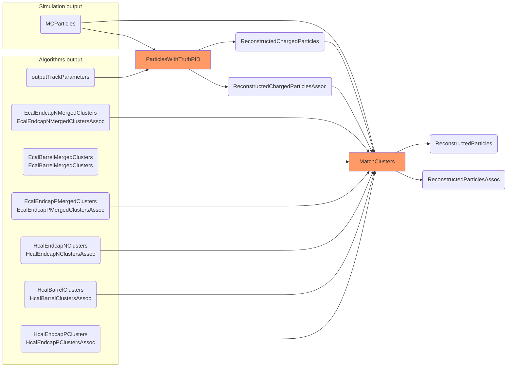

```mermaid
flowchart LR
  classDef alg fill:#f96;
  
  subgraph Simulation output
    MCParticles(MCParticles)
  end
  
  subgraph Algorithms output
    direction TB
    outputTrackParameters(outputTrackParameters)
    EcalEndcapNMergedClusters(EcalEndcapNMergedClusters<br/>EcalEndcapNMergedClustersAssoc)
    EcalBarrelMergedClusters(EcalBarrelMergedClusters<br/>EcalBarrelMergedClusters)
    EcalEndcapPMergedClusters(EcalEndcapPMergedClusters<br />EcalEndcapPMergedClustersAssoc)
    HcalEndcapNClusters(HcalEndcapNClusters<br/>HcalEndcapNClustersAssoc)
    HcalBarrelClusters(HcalBarrelClusters<br/>HcalBarrelClustersAssoc)
    HcalEndcapPClusters(HcalEndcapPClusters<br/>HcalEndcapPClustersAssoc)
  end
  
  MCParticles --> ParticlesWithTruthPID[ParticlesWithTruthPID]:::alg
  outputTrackParameters --> ParticlesWithTruthPID  
  ParticlesWithTruthPID --> ReconstructedChargedParticles(ReconstructedChargedParticles)
  ParticlesWithTruthPID --> ReconstructedChargedParticlesAssoc(ReconstructedChargedParticlesAssoc)
  
  MCParticles --> MatchClusters[MatchClusters]:::alg
  ReconstructedChargedParticles --> MatchClusters
  ReconstructedChargedParticlesAssoc --> MatchClusters
  EcalEndcapNMergedClusters --> MatchClusters
  EcalBarrelMergedClusters --> MatchClusters
  EcalEndcapPMergedClusters --> MatchClusters
  HcalEndcapNClusters --> MatchClusters
  HcalBarrelClusters --> MatchClusters
  HcalEndcapPClusters --> MatchClusters
  
  MatchClusters --> ReconstructedParticles(ReconstructedParticles)
  MatchClusters --> ReconstructedParticlesAssoc(ReconstructedParticlesAssoc)
  
```