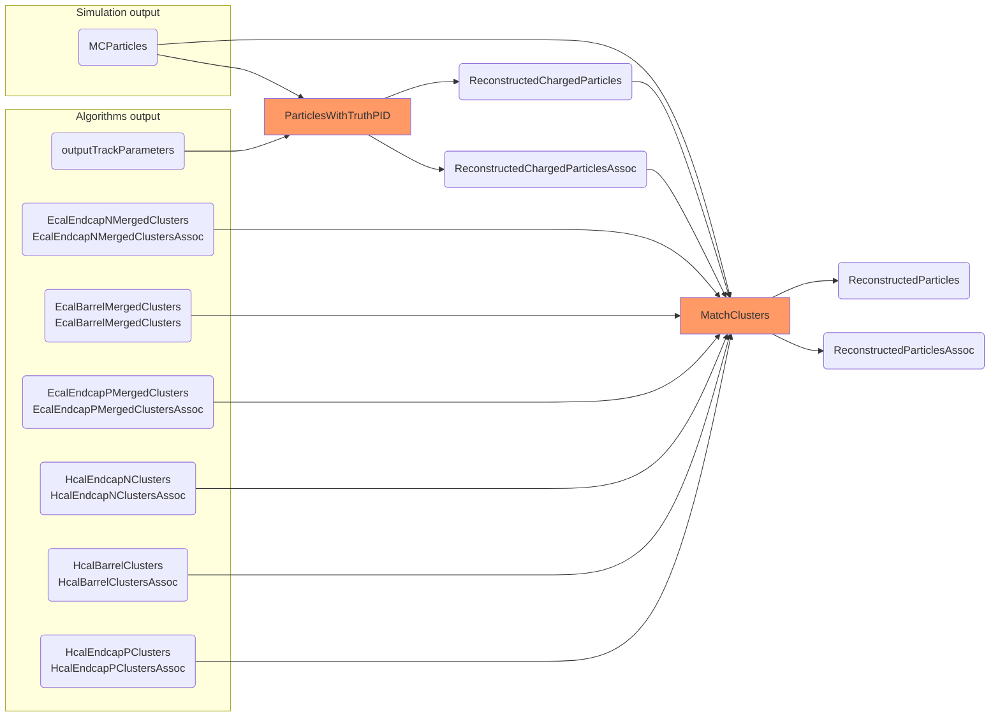

### Tracking related flags: 

#### Acts logging

ACTS has two loggers controlled by two flags: 

- **acts:LogLevel** - General Acts logger. Is used for logging during ACTS reconstruction
- **acts:InitLogLevel** - Initialization Acts logger. Is used for geometry initialization.
  By default, its level is the same as for general logger, but user can set
  it explicitly to only look extended printout of DD4Hep->Acts geometry conversion and other 
  initialization steps


Examples:

```yaml
# ACTS initialization and reconstruction log is set to maximum level:
acts:LogLevel = "trace"

# But now initialization set to "info", no print of geometry import in details
acts:InitLogLevel = "info" 

# Don't print verbose messages during reconstruction, 
# but print full info on initial geometry conversion
acts:LogLevel = "info"
acts:InitLogLevel = "trace"
```

#### Acts material map

Material map in JSon format can be loaded with **acts:MaterialMap** flag: 

```yaml
acts:MaterialMap=/path/to/file/material.cbp
```


### Reconstructed particles chart
