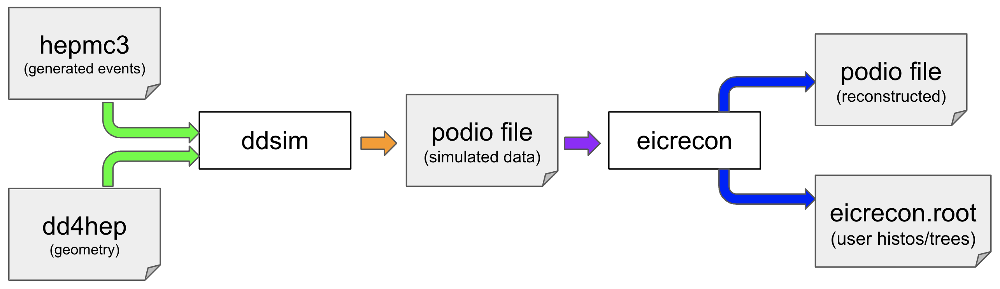

| title        | teaching | exercises | questions | objectives                                                                         | keypoints                                              |
|--------------|----------|-----------|-----------|------------------------------------------------------------------------------------|--------------------------------------------------------|
| Introduction | 5        | 0         |           | Understand scope of tutorial and how EICrecon fits into larger software ecosystem. | EICrecon is the reconstruction piece of EPIC software. |

In this episode we will introduce EICrecon and show where it fits into the EPIC software stack. We will
briefly cover the scope of this tutorial and functionality will be covered.

  

