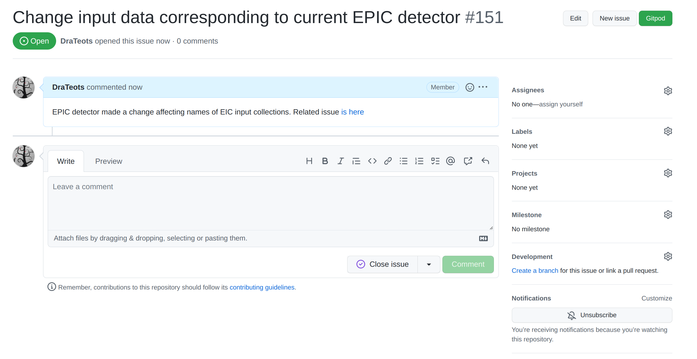
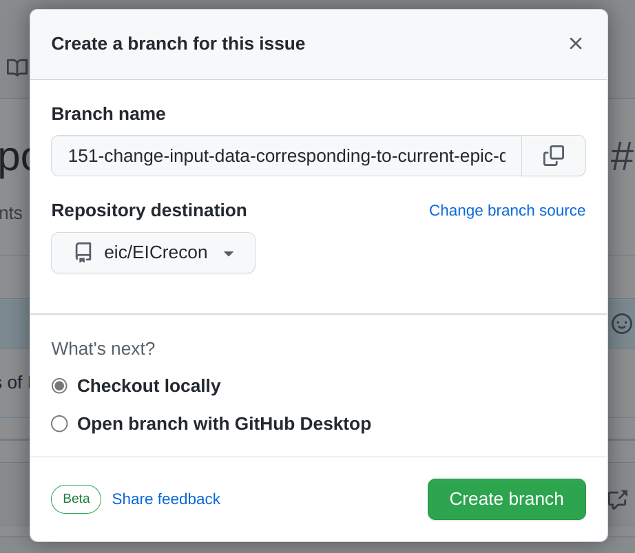
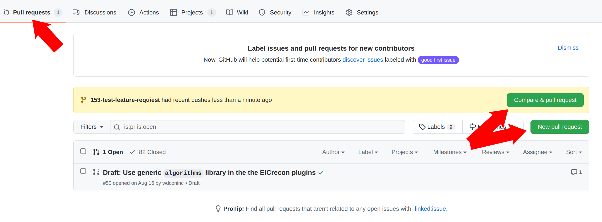
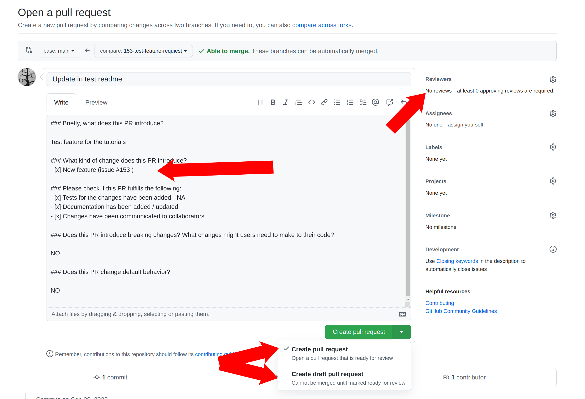

| title                                               | teaching | exercises | questions                                                                                                                                                      | objectives                                                                                           | keypoints                                                                                                                                           |
|-----------------------------------------------------|----------|-----------|----------------------------------------------------------------------------------------------------------------------------------------------------------------|------------------------------------------------------------------------------------------------------|-----------------------------------------------------------------------------------------------------------------------------------------------------|
| Contributing code changes to the EICrecon repository | 10       | 10        | How do I submit code to the EICrecon repository? Understand naming conventions for EICrecon   Submitting a Pull Request for a contribution to EICrecon | Use eicrecon executable to run reconstruction on a podio input file and to create podio output file. | Write code in a style consistent with the rest of the repository.   Contributions should be made through the GitHub Pull Request mechanism. |

## Repository

We use GitHub as the main code repository tool. The repositories are located:

- [EICrecon][eicrecon] - EIC reconstruction algorithms and EIC-related code for JANA framework
- [JANA2][jana2] - The core framework

If you hesitate where to file an issue or a question, then the most probably it should be done in EICrecon project. There are [EICrecon issues][eicrecon-issues] and [discussions](https://github.com/eic/EICrecon/discussions)

There is also [EICrecon project board][eicrecon-project] where one can see what issues are in work and what could be picked up.

#### Exercise:

- Go to [EICrecon project board][eicrecon-project] and see what tickets are marked as "TODO"

## Contributing workflow

- A workflow starts from creating an issue with a bug report or a feature request. It is important to create an issue even if the subject was discussed on a meeting, personally, etc.

- Then create a branch out of the issue.

   

   

- After you commit and push changes to the branch, create a pull request (PR). As soon as PR is created a continuous integration (CI) system will run to test the project compiles and runs on EIC environment. Any further push to this branch will trigger CI rerun the tests and check if merge is ready to be done. PRs are also a good place do discuss changes and code with collaborators. So it might be reasonable to create a PR even if not all work on issue is done. In this case create a Draft PR.

   

   

   To summarize:

   - Create PR
   - Fill the information
   - Use "Draft PR" if the work is not done
   - Assign a reviewer

- Before accepting the Pull Request code goes through a code review by one of the core developers. If you need someone particular to review your changes - select the reviewer from the menu. Otherwise one of the developers will review the code and accept the PR.

More on the EIC contribution guide is in [this tutorial][eic-environment-tutorial], [video][eic-environment-youtube]

## Coding style

One can find coding style and other contributions policies at [CONTRIBUTING.md](https://github.com/eic/EICrecon/blob/main/CONTRIBUTING.md). It is yet to be finished but one can find current decisions on coding style there

## References

- [EICrecon][eicrecon]
- [EICrecon-project][eicrecon-project]
- [EICrecon-issues][eicrecon-issues]
- [EICrecon-discussions][eicrecon-discussions]
- [jana2][jana2]
- [EIC environment - youtube][eic-environment-youtube]
- [EIC environment - tutorial][eic-environment-tutorial]

[eicrecon]: https://github.com/eic/EICrecon
[eicrecon-project]: https://github.com/orgs/eic/projects/6/views/1
[eicrecon-issues]: https://github.com/eic/EICrecon/issues
[eicrecon-discussions]: https://github.com/eic/EICrecon/discussions
[jana2]: https://github.com/JeffersonLab/JANA2
[eic-environment-youtube]: https://youtu.be/Y0Mg24XLomY?list=PLui8F4uNCFWm3M3g3LG2cOledhI7IvTAJ
[eic-environment-tutorial]: https://eic.github.io/tutorial-setting-up-environment/

[EICrecon project on GitHub]()


