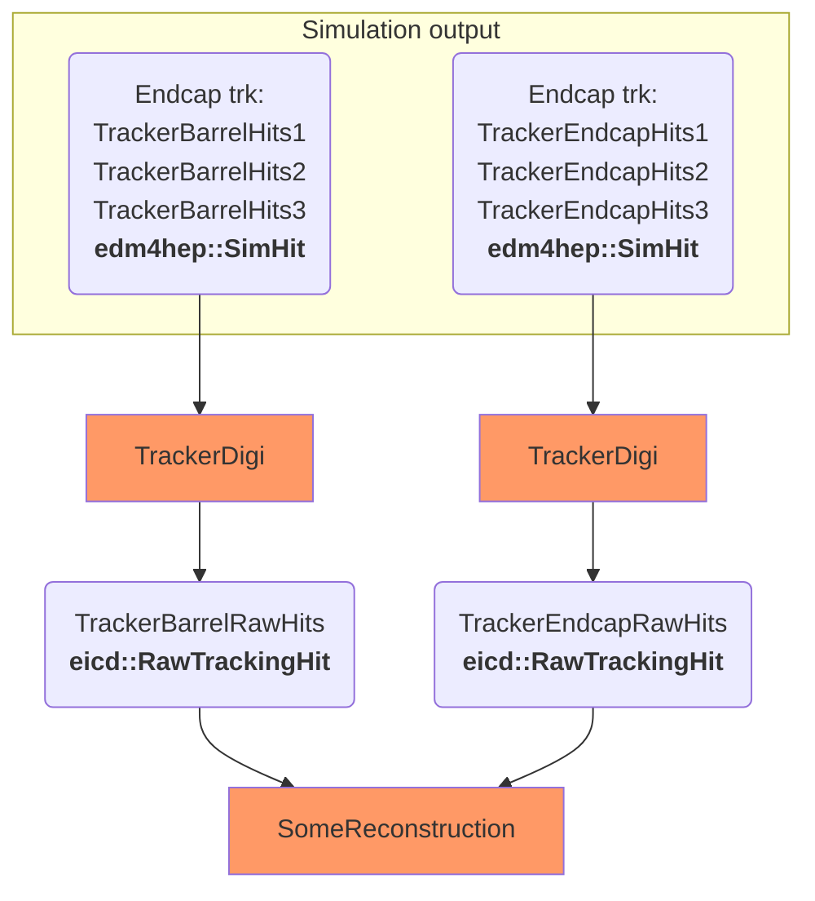

We have a chain that looks like this: 

```mermaid
flowchart TB
  classDef alg fill:#f96;
  subgraph Simulation output
    direction LR
    tracker_endcap_collections(Endcap trk:<br />TrackerEndcapHits1<br/>TrackerEndcapHits2<br/>TrackerEndcapHits3<br/><strong>edm4hep::SimHit</strong>)
    tracker_barrel_collections(Endcap trk:<br />TrackerBarrelHits1<br/>TrackerBarrelHits2<br/>TrackerBarrelHits3<br/><strong>edm4hep::SimHit</strong>)
  end
  
  tracker_barrel_collections --> TrackerDigi[TrackerDigi]:::alg
  TrackerDigi --> TrackerBarrelRawHits(TrackerBarrelRawHits<br/><strong>eicd::RawTrackingHit</strong>)
    
  tracker_endcap_collections --> TrackerDigi2[TrackerDigi]:::alg
  TrackerDigi2 --> TrackerEndcapRawHits(TrackerEndcapRawHits<br/><strong>eicd::RawTrackingHit</strong>)
  
  TrackerSourceLinker[SomeReconstruction]:::alg
  
  TrackerBarrelRawHits --> TrackerSourceLinker
  TrackerEndcapRawHits --> TrackerSourceLinker  
```
