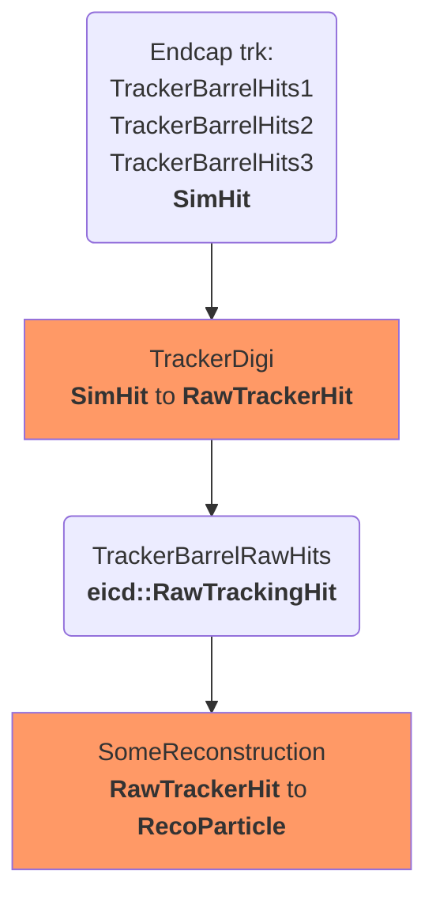

We have a chain that looks like this: 


To simplify lets look at one chain: 





The proposed solution: 

```
JChainFactoryGeneratorT.h
JChainFactoryT.h
```

Requirements satisfied

- Works in JANA paradigm
- Has the right defaults
- Can be changed/rewired without recompilation
- Can be raplaced by other plugin


How it works: 

- JChainFactoryT is a JFactoryT, that have just one property: 

  ```c++
  std::vector<std::string> m_default_input_tags;
  ```
  
- JChainFactoryGeneratorT allows to construct JChainFactoryT with default input tags and output tag name: 

   ```c++
   extern "C" {
   void InitPlugin(JApplication *app) {
        InitJANAPlugin(app);

        using namespace eicrecon;
        // Digitization
        app->Add(new JChainFactoryGeneratorT<SiliconTrackerDigi_factory>({"TrackerBarrelHits1", "TrackerBarrelHits2"},"BarrelTrackerRawHit"));

        // Convert raw digitized hits into hits with geometry info (ready for tracking)
        app->Add(new JChainFactoryGeneratorT<TrackerHitReconstruction_factory>({"BarrelTrackerRawHit"}, "BarrelTrackerHit"));

        // app->Add(new EicFactoryGeneratorT<Factory>(output_tag);

    }
}
   

  
  


