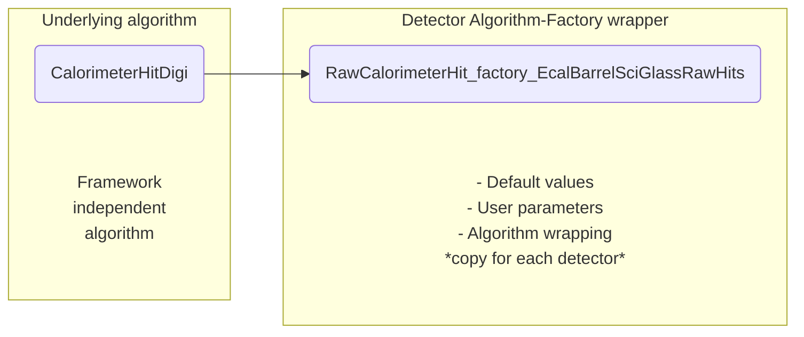
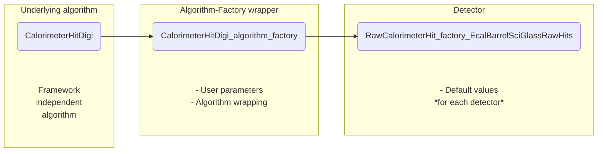

## Current situation

We have now:

- There are calorimetry algorithms separated from factories.
- Those pure algorithms could be modified in one place affecting all detectors using the algorithms.
- Each detector creates a bunch of factories that wrap the algorithms
- The factories copy paste exact same code for each of the detector

For example, BEMC now has files:

```
CalorimeterHit_factory_EcalBarrelImagingRecHits.h
CalorimeterHit_factory_EcalBarrelScFiMergedHits.h
CalorimeterHit_factory_EcalBarrelScFiRecHits.h
CalorimeterHit_factory_EcalBarrelSciGlassRecHits.h
Cluster_factory_EcalBarrelImagingClusters.h
Cluster_factory_EcalBarrelImagingMergedClusters.h
Cluster_factory_EcalBarrelScFiClusters.h
Cluster_factory_EcalBarrelSciGlassClusters.h
Cluster_factory_EcalBarrelSciGlassMergedClusters.h
Cluster_factory_EcalBarrelSciGlassMergedTruthClusters.h
Cluster_factory_EcalBarrelSciGlassTruthClusters.h
ProtoCluster_factory_EcalBarrelImagingProtoClusters.h
ProtoCluster_factory_EcalBarrelScFiProtoClusters.h
ProtoCluster_factory_EcalBarrelSciGlassProtoClusters.h
ProtoCluster_factory_EcalBarrelTruthSciGlassProtoClusters.h
RawCalorimeterHit_factory_EcalBarrelImagingRawHits.h
RawCalorimeterHit_factory_EcalBarrelScFiRawHits.h
RawCalorimeterHit_factory_EcalBarrelSciGlassRawHits.h
```
Those factories are not unique to BEMC but just a copy of the same code repeating for each calorimeter

To illustrate it more. We have
[CalorimeterHitDigi algorithm](https://github.com/eic/EICrecon/blob/v0.3.1/src/algorithms/calorimetry/CalorimeterHitDigi.h)
and 13 wrapping factories [with the same code](https://github.com/eic/EICrecon/blob/v0.3.1/src/detectors/BEMC/RawCalorimeterHit_factory_EcalBarrelSciGlassRawHits.h)


How then those files differ? 

- Input data tag names
- Ouput data tag name
- Flag names
- Default values


**So if any change or a bug fix is required for a wrapping factory, this change has to be manually copied for each of the detector. That is not appropriate.**

There are current bugs that are known and features needed for campaign such as proper truth association, that would require fixing manually the same code again and again in each factory.

Duplication of factories produce other problems like setting default values is convoluted for experts thus we have to use reco_file.py (see #214) to make it easier for users. While this is not a direct problem this issue tries to solve.


## Requirements

There are many ways how one would want to refactor EICrecon in its current state. But we have to:

- Not to disturb simulation campaign by introducing cardinal changes
- Not to disturb simulation campaign by braking what is working
- Not to disturb work that users do on detectors
- Make minimal risks to introduce new bugs

## Proposed solution

Make base classes from factories that are copied over, so those factories for each of the detector define only default values. There is a working example. 

#### BEFORE:



#### AFTER:




[Example](https://github.com/eic/EICrecon/tree/dr-calorimetry-rehaul/src/detectors/BEMCSciGlass): 

- [CalorimeterHitDigi_algorithm_factory](https://github.com/eic/EICrecon/blob/dr-calorimetry-rehaul/src/global/calorimetry/CalorimeterHitDigi_algorithm_factory.h) which any concrete detector can now use to produce Raw\<name\>Hits
- [RawCalorimeterHit_factory_EcalBarrelSciGlassRawHits](https://github.com/eic/EICrecon/blob/dr-calorimetry-rehaul/src/detectors/BEMCSciGlass/RawCalorimeterHit_factory_EcalBarrelSciGlassRawHits.h)
  Now is based on CalorimeterHitDigi_algorithm_factory and only defines default values for a particular calorimeter
- Since we follow naming convention for user parameters (flags), it is easy to automatically deduce flag names by Plugin:Tag:Name

#### Benefits

Removes all duplication. Now folders like BEMC have only default parameters

- All working algorithms are not disturbed by the change, minimal risks to make this change
- Nothing that works should be actually changed i.e. broken
- All flags will be the same, no changes in scripts, run instruction, anything is needed
- No new detector classes layout, file names changes, etc. 
- If users work on factories they may be left intact (not changed to be derived from YYY_algorithm_factory)
  so no user work is disturbed 
- It will be easier to edit default parameters
- It will be easy to get rid of nightmare reco_flags.py quickly
- It will be easy to further refactor EICrecon after the campaign

#### Risk mitigation

Certainly benchmarks should produce the same results in order the changes to be merged in


