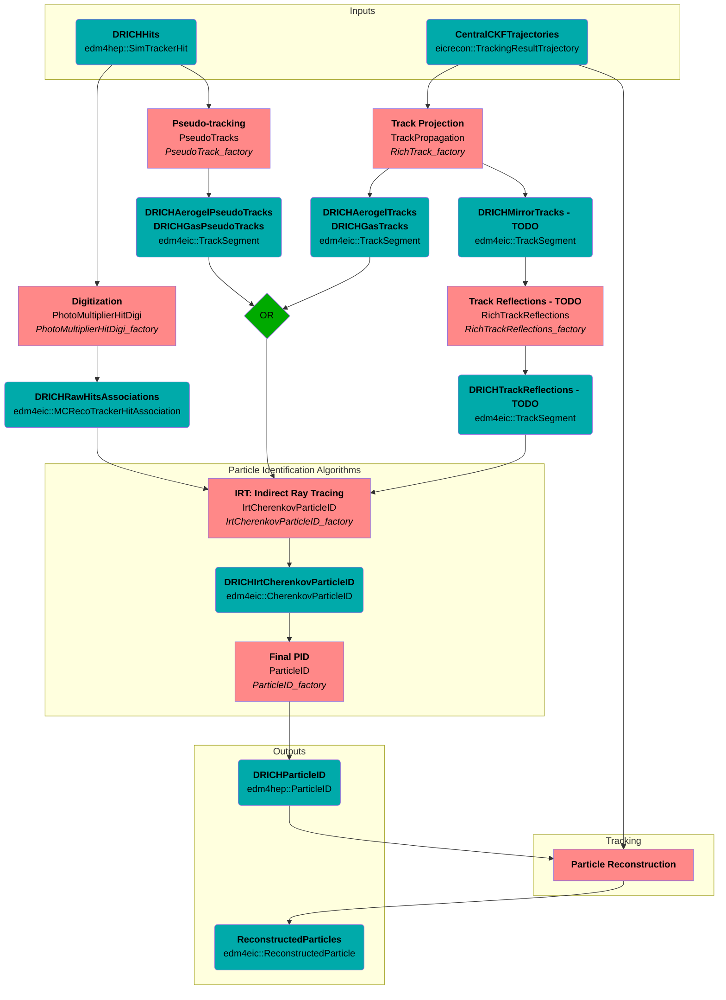

# dRICH

## Algorithm and Data Flowchart
### Legend
- Blue, rounded boxes: collection
  - **collection name**
  - collection datatype
- Red, squared boxes: algorithm
  - **description**
  - algorithm name
  - *factory name*

### Flowchart

