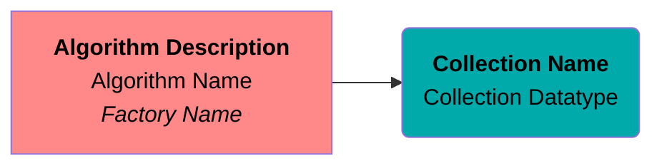
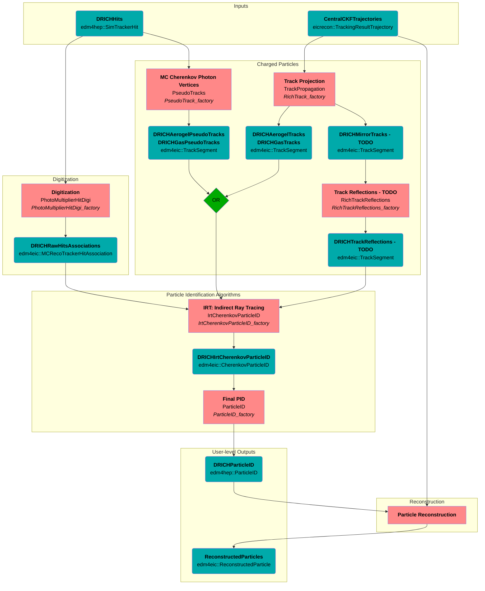

# dRICH

## Algorithm and Data Flowchart
### Legend


### Flowchart


## Datatypes, Relations, and Associations

### Detailed PID Datatype: `edm4eic::CherenkovParticleID`
```mermaid
flowchart LR
  classDef data fill:#aaaa00,color:black
  classDef comp fill:#ff8888,color:black

  %% nodes
  subgraph IrtCherenkovParticleID Output Collections
    direction TB
    CPIDAgl(<strong>DRICHIrtCherenkovParticleID</strong><br/>edm4eic::CherenkovParticleID):::data
    CPIDGas(<strong>DRICHIrtCherenkovParticleID</strong><br/>edm4eic::CherenkovParticleID):::data
    subgraph <strong>hypotheses</strong><br/>edm4eic::CherenkovParticleIDHypothesis
      direction TB
      HypAgl1([Pion])::comp
      HypAgl2([Kaon])::comp
      HypAgl3([...])::comp
    end
    subgraph <strong>hypotheses</strong><br/>edm4eic::CherenkovParticleIDHypothesis
      direction TB
      HypGas1([Pion])::comp
      HypGas2([Kaon])::comp
      HypGas3([...])::comp
    end
  end
  TrackAgl(<strong>DRICHAerogelTracks</strong><br/>edm4eic::TrackSegment):::data
  TrackGas(<strong>DRICHGasTracks</strong><br/>edm4eic::TrackSegment):::data

  %% edges
  CPIDAgl --> HypAgl1
  CPIDAgl --> HypAgl2
  CPIDAgl --> HypAgl3
  CPIDAgl --> TrackAgl
  CPIDGas --> HypGas1
  CPIDGas --> HypGas2
  CPIDGas --> HypGas3
  CPIDGas --> TrackGas
```

### User-level PID Output
- `DRICHAerogelTracks` and `DRICHGasTracks` are combined to `DRICHTracks`
- `DRICHIrtCherenkovParticleID::hypotheses` are combined from each radiator, and transformed to `edm4hep::ParticleID`
  objects named `DRICHParticleID`
- Then use (eta,phi) proximity matching to find the `ReconstructedParticle` that corresponds to the `DRICHTrack`, and
  link particle ID objects
```mermaid
flowchart LR
  classDef data fill:#aaaa00,color:black
  classDef comp fill:#ff8888,color:black
  classDef op fill:#00aa00,color:black

  %% nodes
  Track(<strong>DRICHTracks</strong><br/>edm4eic::TrackSegment):::data
  subgraph <strong>DRICHParticleID</strong>
    direction TB
    Hyp1(<strong>DRICHParticleID, PDG=pion</strong><br/>edm4hep::ParticleID):::data
    Hyp2(<strong>DRICHParticleID, PDG=kaon</strong><br/>edm4hep::ParticleID):::data
    Hyp3(<strong>DRICHParticleID, PDG=...</strong><br/>edm4hep::ParticleID):::data
  end
  Prox{{proximity match}}:::op
  Recon(<strong>ReconstructedParticles</strong><br/>edm4eic::ReconstructedParticle):::data

  %% edges
  Track --> Hyp1
  Track --> Hyp2
  Track --> Hyp3
  Track --> Prox
  Prox --> Recon
  Recon --> Hyp1
  Recon --> Hyp2
  Recon --> Hyp3
```
