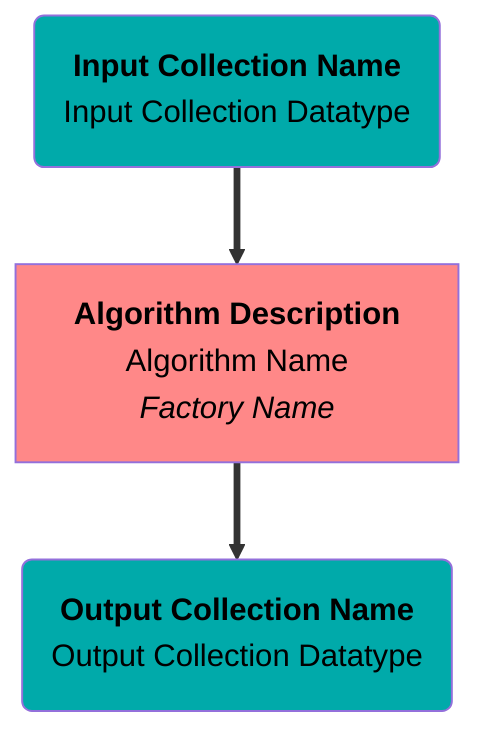
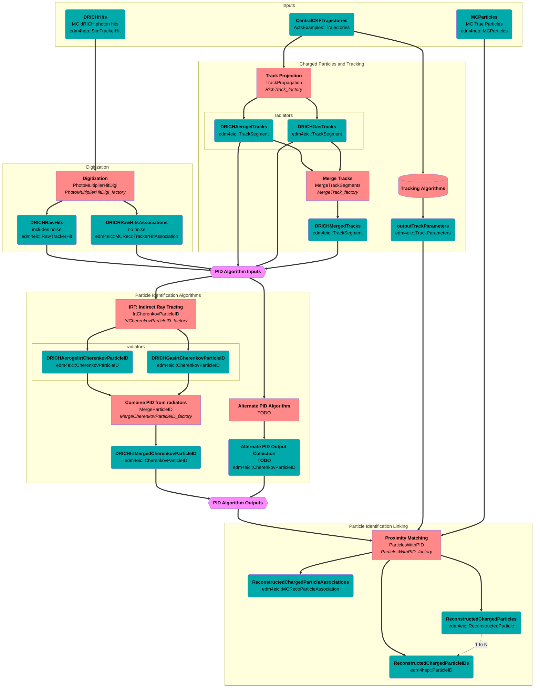
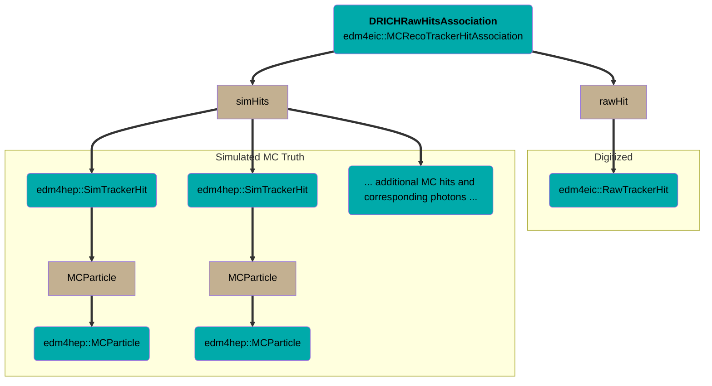

# dRICH

## Algorithms and Data Flowchart

The following is a flowchart of algorithms and collections corresponding to **P**article **Id**entification (PID)
from the **D**ual **R**ing **I**maging **Ch**erenkov (dRICH) detector.

### Legend


### Flowchart


## Data Model

### Digitized Hits
- All digitized hits, including noise hits, are stored as `edm4eic::RawTrackerHit` collections
- Association `edm4eic::MCRecoTrackerHitAssociation` stores the 1-N link from a digitized hit to the MC truth hits
  - each MC truth hit has a 1-1 relation to the original MC `opticalphoton` (or whatever particle caused the hit)
  - digitized noise hits will not have associated MC truth hits, and therefore do not appear in `edm4eic::MCRecoTrackerHitAssociation` collections


### Expert-level PID Output
- RICH-specific particle ID datatype `edm4eic::CherenkovParticleID`
  - From IRT: aerogel and gas results separated
  - Vector member of `edm4eic::CherenkovParticleIDHypothesis` components, one for each PID hypothesis, with members:
    - PDG
    - NPE
    - weight
  - Additional members:
    - Reconstructed Cherenkov (theta, phi) for each photon
    - NPE
    - MC: average photon energy and refractive index at emission point
    - Link to charged particle and hit-associations
  - 1-1 relation to corresponding charged particle `edm4eic::TrackSegment`
    - points to the _same_ `DRICHMergedTrack`, to facilitate merging aerogel and gas PID results

```mermaid
flowchart TB
  classDef col fill:#00aaaa,color:black
  classDef fn fill:#c3b091,color:black
  classDef comp fill:#8888ff,color:black

  %% nodes
  CPIDAgl(<strong>DRICHAerogelIrtCherenkovParticleID</strong><br/>edm4eic::CherenkovParticleID):::col
  CPIDGas(<strong>DRICHGasIrtCherenkovParticleID</strong><br/>edm4eic::CherenkovParticleID):::col
  HypAglFn[hypotheses]:::fn
  HypGasFn[hypotheses]:::fn

  subgraph <strong>hypotheses from aerogel</strong>
    direction TB
    HypAgl0([Electron]):::comp
    HypAgl1([Pion]):::comp
    HypAgl2([Kaon]):::comp
    HypAgl3([Proton]):::comp
  end
  subgraph <strong>hypotheses from gas</strong>
    direction TB
    HypGas0([Electron]):::comp
    HypGas1([Pion]):::comp
    HypGas2([Kaon]):::comp
    HypGas3([Proton]):::comp
  end

  TrackAglFn[chargedParticle]:::fn
  TrackGasFn[chargedParticle]:::fn
  Track(<strong>DRICHMergedTracks</strong><br/>edm4eic::TrackSegment):::col

  %% edges
  CPIDAgl ==> HypAglFn
  HypAglFn   ==> HypAgl0
  HypAglFn   ==> HypAgl1
  HypAglFn   ==> HypAgl2
  HypAglFn   ==> HypAgl3
  CPIDAgl ==> TrackAglFn ==> Track
  CPIDGas ==> HypGasFn
  HypGasFn   ==> HypGas0
  HypGasFn   ==> HypGas1
  HypGasFn   ==> HypGas2
  HypGasFn   ==> HypGas3
  CPIDGas ==> TrackGasFn ==> Track
```

### User-level PID Output
- Add `edm4hep::ParticleID` objects to `ReconstructedParticle`
  - `edm4hep::ParticleID` objects include a likelihood, PDG (and some index variables and `float` parameters for full generality)
  - Use 1-1 relation `ReconstructedParticle::particleIDUsed` to specify the most-likely `edm4hep::ParticleID` object;
    the diagram below exemplifies this for a pion
  - Use 1-N relation `ReconstructedParticle::particleIDs` to link all the `edm4hep::ParticleID` objects
- User can then access PDG via:
```cpp
ReconstructedParticleAssociation.getRec().getParticleIDUsed().getPDG(); // most likely PDG from PID
ReconstructedParticleAssociation.getSim().getPDG();                     // true PDG
```
```mermaid
flowchart TB
  classDef col fill:#00aaaa,color:black
  classDef fn fill:#c3b091,color:black
  classDef comp fill:#8888ff,color:black

  %% nodes
  ReconPart(<strong>ReconstructedChargedParticles</strong><br/>edm4eic::ReconstructedParticle):::col
  ReconAssoc(<strong>ReconstructedChargedParticleAssociations</strong><br/>edm4eic::MCRecoParticleAssociation):::col
  MCPart(<strong>MCParticles</strong><br/>MC True Particles<br/>edm4hep::MCParticles):::col
  RecFn[rec]:::fn
  SimFn[sim]:::fn

  PDGReconFn[PDG]:::fn
  PDGMCFn[PDG]:::fn

  PDGTrue([True PDG]):::comp

  ParticleIDsFn[particleIDs]:::fn
  ParticleIDUsedFn[particleIDUsed]:::fn

  subgraph <strong>Particle ID Objects</strong>
    direction LR
    Hyp0(edm4hep::ParticleID):::col ==> Pdg0Fn[PDG]:::fn ==> Pdg0([Electron]):::comp
    Hyp1(edm4hep::ParticleID):::col ==> Pdg1Fn[PDG]:::fn ==> Pdg1([Pion]):::comp
    Hyp2(edm4hep::ParticleID):::col ==> Pdg2Fn[PDG]:::fn ==> Pdg2([Kaon]):::comp
    Hyp3(edm4hep::ParticleID):::col ==> Pdg3Fn[PDG]:::fn ==> Pdg3([Proton]):::comp
  end

  %% edges
  ReconAssoc ==> RecFn   ==> ReconPart
  ReconAssoc ==> SimFn   ==> MCPart
  ReconPart  ==>|TO BE REMOVED| PDGReconFn ==> PDGTrue
  MCPart     ==> PDGMCFn ==> PDGTrue

  ReconPart ==> ParticleIDUsedFn ==> Hyp1
  ReconPart ==> ParticleIDsFn

  ParticleIDsFn ==> Hyp0
  ParticleIDsFn ==> Hyp1
  ParticleIDsFn ==> Hyp2
  ParticleIDsFn ==> Hyp3
  ```
