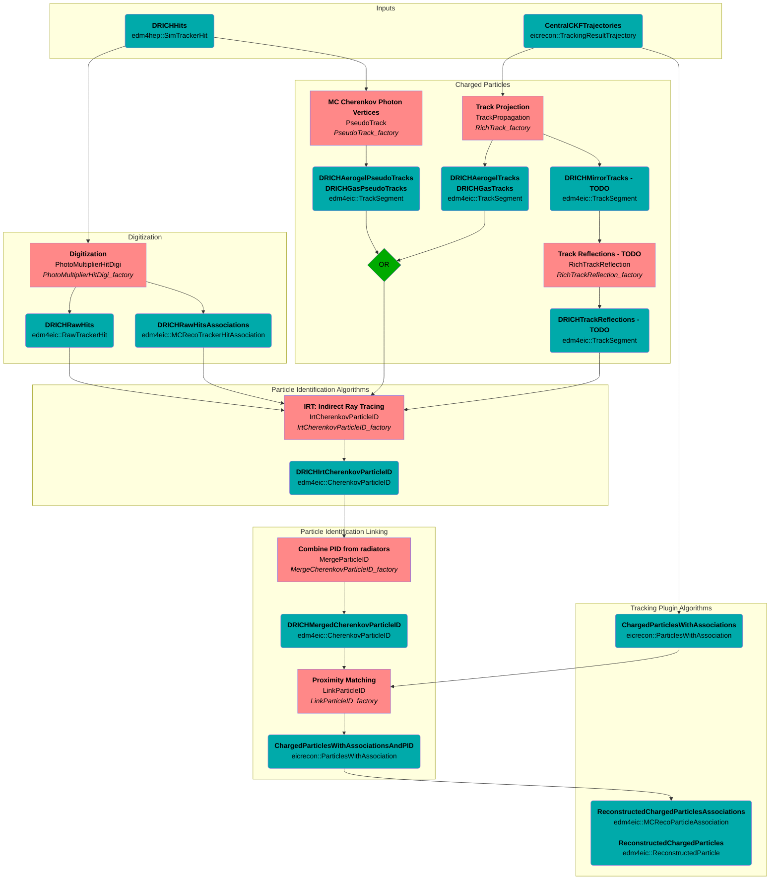

# dRICH

## Algorithms and Data Flowchart
### Legend


### Flowchart


## Data Model

### Digitized Hits
- Association `edm4eic::MCRecoTrackerHitAssociation` stores the 1-N link from a digitized hit to the MC truth hits
  - each MC truth hit has a 1-1 relation to the original MC `opticalphoton` (or whatever particle caused the hit)
  - digitized noise hits will not have associated MC truth hits


### Expert-level PID Output
- RICH-specific particle ID datatype `edm4eic::CherenkovParticleID`
  - Vector components `edm4eic::CherenkovParticleIDHypothesis`, one for each PID hypothesis
  - 1-1 relation to corresponding charged particle `edm4eic::TrackSegment`
- Aerogel and Gas results are combined to one collection: `DRICHIrtCherenkovParticleID`
```mermaid
flowchart LR
  classDef col fill:#00aaaa,color:black
  classDef comp fill:#8888ff,color:black

  %% nodes
  TrackAgl(<strong>DRICHAerogelTracks</strong><br/>edm4eic::TrackSegment):::col
  TrackGas(<strong>DRICHGasTracks</strong><br/>edm4eic::TrackSegment):::col
  subgraph DRICHIrtCherenkovParticleID
    direction TB
    CPIDAgl(<strong>DRICHIrtCherenkovParticleID</strong><br/>edm4eic::CherenkovParticleID):::col
    CPIDGas(<strong>DRICHIrtCherenkovParticleID</strong><br/>edm4eic::CherenkovParticleID):::col
  end
  subgraph <strong>hypotheses, from aerogel</strong><br/>edm4eic::CherenkovParticleIDHypothesis
    direction TB
    HypAgl0([Electron Hypothesis]):::comp
    HypAgl1([Pion Hypothesis]):::comp
    HypAgl2([Kaon Hypothesis]):::comp
    HypAgl3([Proton Hypothesis]):::comp
  end
  subgraph <strong>hypotheses, from gas</strong><br/>edm4eic::CherenkovParticleIDHypothesis
    direction TB
    HypGas0([Electron Hypothesis]):::comp
    HypGas1([Pion Hypothesis]):::comp
    HypGas2([Kaon Hypothesis]):::comp
    HypGas3([Proton Hypothesis]):::comp
  end

  %% edges
  CPIDAgl -- hypotheses --> HypAgl0
  CPIDAgl -- hypotheses --> HypAgl1
  CPIDAgl -- hypotheses --> HypAgl2
  CPIDAgl -- hypotheses --> HypAgl3
  CPIDAgl -- chargedParticle --> TrackAgl
  CPIDGas -- hypotheses --> HypGas0
  CPIDGas -- hypotheses --> HypGas1
  CPIDGas -- hypotheses --> HypGas2
  CPIDGas -- hypotheses --> HypGas3
  CPIDGas -- chargedParticle --> TrackGas
```

### User-level PID Output
- Add `edm4hep::ParticleID` objects to `ReconstructedParticle`
  - Use 1-1 relation `ReconstructedParticle::particleIDUsed` to specifiy the most-likely `edm4hep::ParticleID` object, and
    set `ReconstructedParticle::PDG` accordingly; the diagram below exemplifies this for a pion
  - Use 1-N relation `ReconstructedParticle::particleIDs` to link all the `edm4hep::ParticleID` objects
- User can then access the most-likely PDG via:
```cpp
ReconstructedParticle::getPDG();                      // EDM4eic specific; could be be filled with true PDG instead
ReconstructedParticle::getParticleIDUsed().getPDG();  // alternative; always PDG from PID (more consistent with EDM4hep)
```
```mermaid
flowchart LR
  classDef col fill:#00aaaa,color:black
  classDef alg fill:#ff8888,color:black
  classDef comp fill:#8888ff,color:black

  %% nodes
  Recon(<strong>ReconstructedParticleWithDRICHParticleID</strong><br/>edm4eic::ReconstructedParticle):::col
  subgraph <strong>DRICHParticleID</strong>
    direction LR
    Hyp0(<strong>DRICHParticleID</strong><br/>edm4hep::ParticleID):::col --> Pdg0([PDG=electron]):::comp
    Hyp1(<strong>DRICHParticleID</strong><br/>edm4hep::ParticleID):::col --> Pdg1([PDG=pion]):::comp
    Hyp2(<strong>DRICHParticleID</strong><br/>edm4hep::ParticleID):::col --> Pdg2([PDG=kaon]):::comp
    Hyp3(<strong>DRICHParticleID</strong><br/>edm4hep::ParticleID):::col --> Pdg3([PDG=proton]):::comp
  end

  %% edges
  Recon -- particleIDs --> Hyp0
  Recon -- particleIDs --> Hyp1
  Recon -- particleIDUsed --> Hyp1
  Recon -- PDG --> Pdg1
  Recon -- particleIDs --> Hyp2
  Recon -- particleIDs --> Hyp3
  ```
