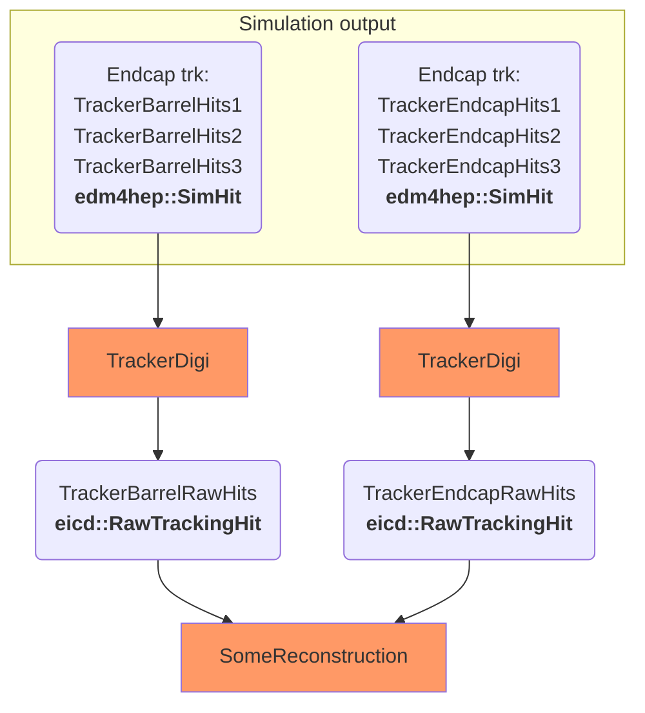
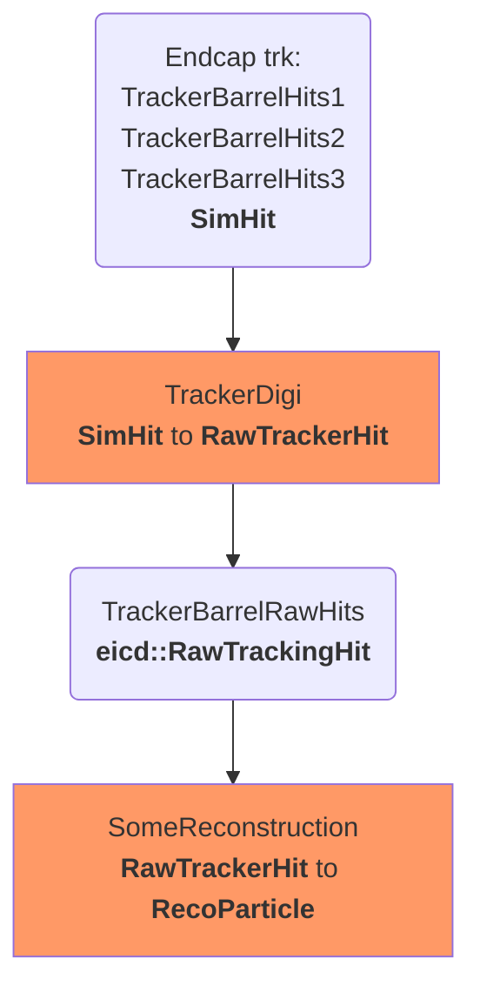

We have a chain that looks like this: 




The proposed solution: 

```
JChainFactoryGeneratorT.h
JChainFactoryT.h
```

Requirements satisfied

- Works in JANA paradigm
- Has the right defaults
- Can be changed/rewired without recompilation
- Can be raplaced by other plugin


To simplify lets look at one chain: 





How it works: 

1- JChainFactoryT is a JFactoryT, that have just one additional property: 

```c++
std::vector<std::string> m_default_input_tags;
```
  
2- JChainFactoryGeneratorT allows to construct JChainFactoryT with default input tags and output tag name: 

 ```c++
 extern "C" {
 void InitPlugin(JApplication *app) {
      InitJANAPlugin(app);

      using namespace eicrecon;
      // Digitization
      app->Add(new JChainFactoryGeneratorT<SiliconTrackerDigi_factory>({"TrackerBarrelHits1", "TrackerBarrelHits2"},"BarrelTrackerRawHit"));

      // Convert raw digitized hits into hits with geometry info (ready for tracking)
      app->Add(new JChainFactoryGeneratorT<TrackerHitReconstruction_factory>({"BarrelTrackerRawHit"}, "BarrelTrackerHit"));

      // ...
```

3- On factory level we allow users to change input tags and (maybe) even output tag and check if default or overriden values to be used: 

```C++

// Declared in SiliconTrackerDigi_factory
std::vector<std::string> m_input_tags;          

void eicrecon::SiliconTrackerDigi_factory::Init() {
    // Parameters names is defined by factory tag
    std::string param_prefix = "SiTrkDigi_" + GetTag();   // Will be something like SiTrkDigi_BarrelTrackerRawHit
    
    // ...
    pm->SetDefaultParameter(param_prefix + ":input_tags", m_input_tags, "Input data tag names");
}


void eicrecon::SiliconTrackerDigi_factory::Process(const std::shared_ptr<const JEvent> &event) {

    // Now we check that user provided an input names
    std::vector<std::string> &input_tags = m_input_tags;
    if(input_tags.size() == 0) {
        input_tags = GetDefaultInputTags();
    }

    // Collect all hits from input sources
    for(auto input_tag: input_tags) {
        auto simHits = event->Get<edm4hep::SimTrackerHit>(input_tag);
        // DO SOMETHING
    }
    //...
}
```

Now everything is wired by default. But users can replace wiring by: 

```sh
eicrecon ... -PSiTrkDigi_BarrelTrackerRawHit:input_tags=AnotherSource1,AnotherHitSource2 
```
