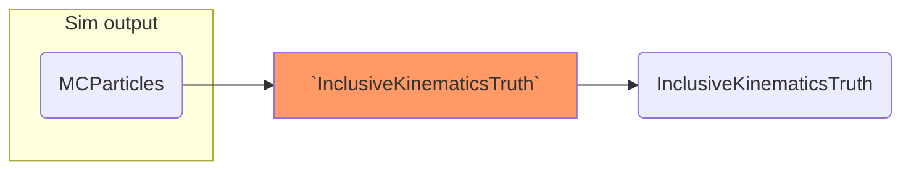
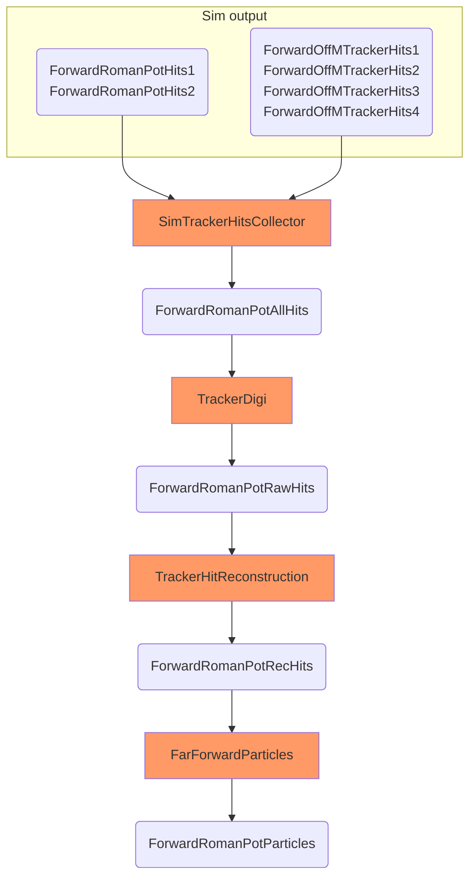
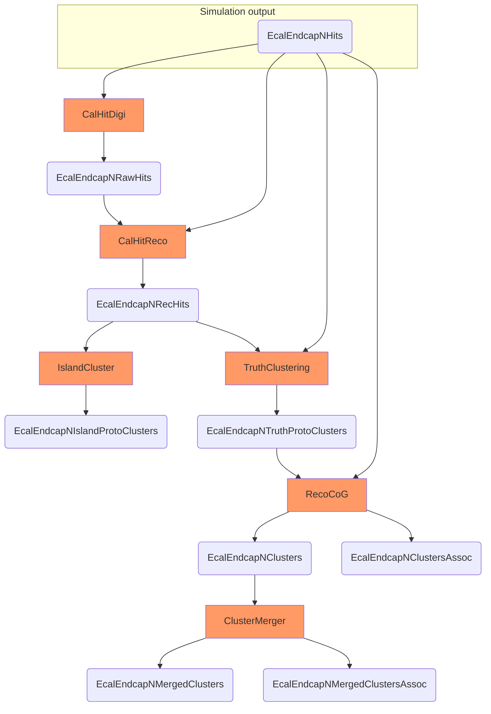
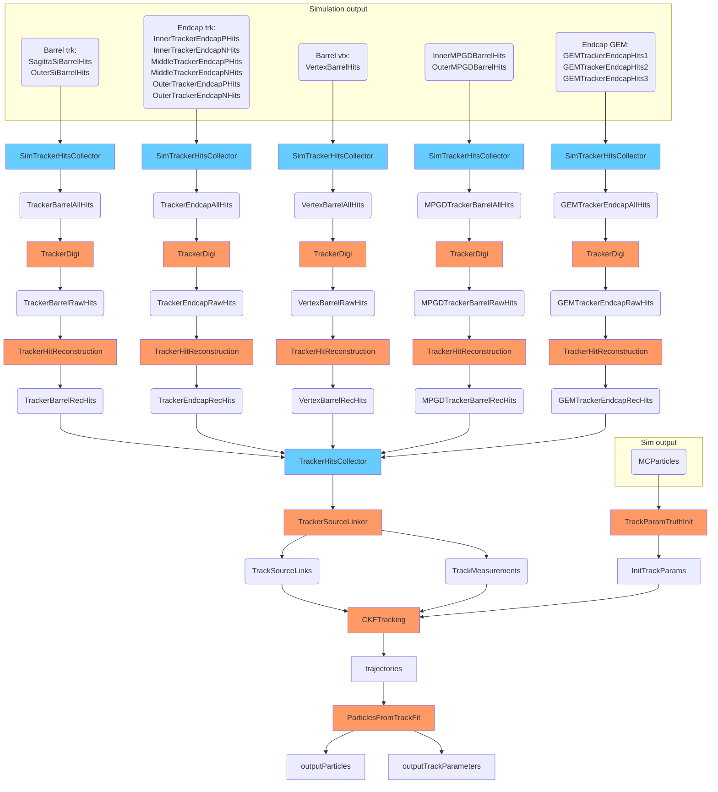
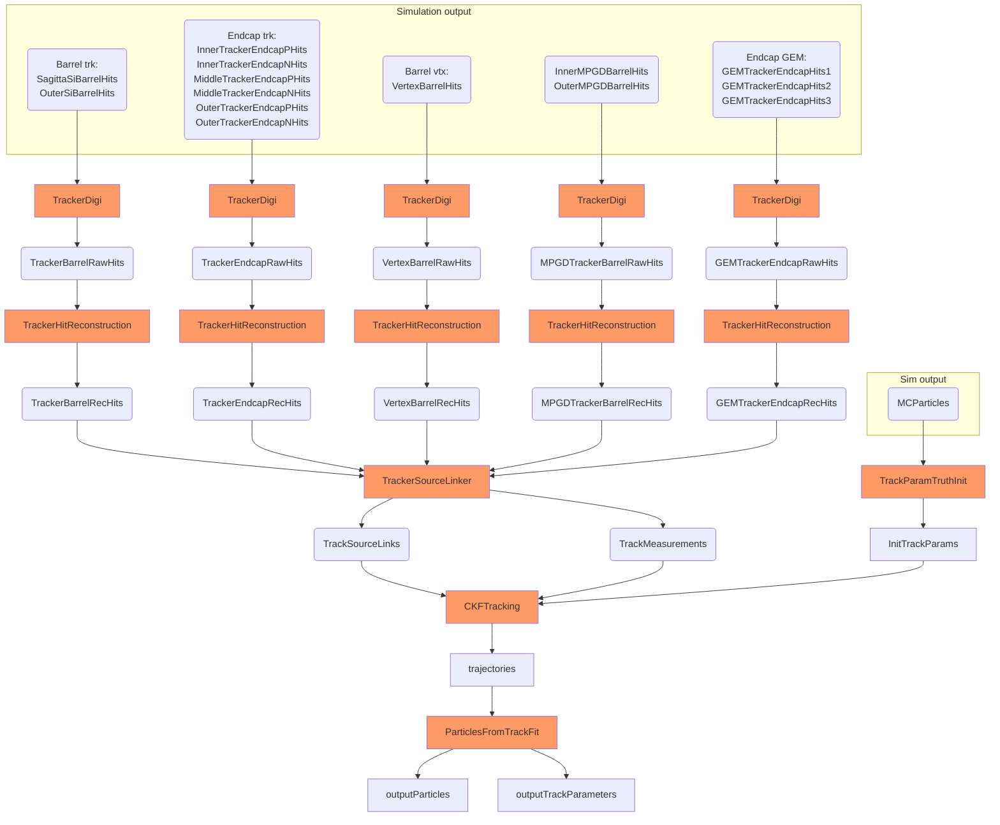
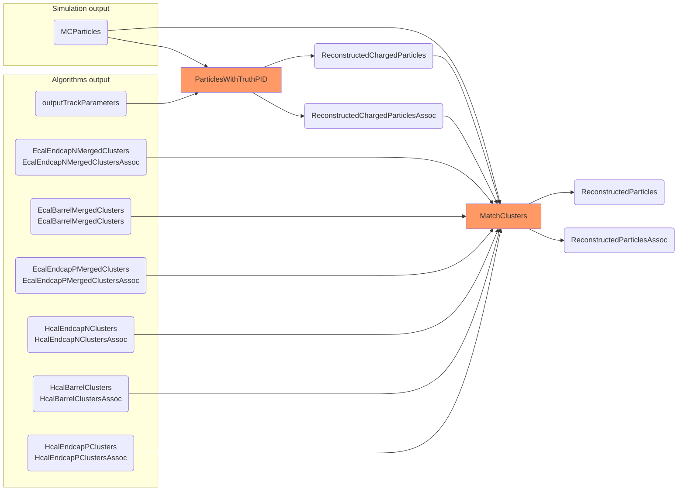
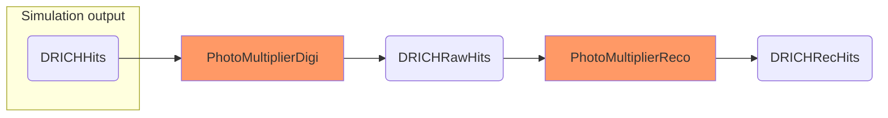

### [Generated particles](https://eicweb.phy.anl.gov/EIC/benchmarks/physics_benchmarks/-/blob/master/options/reconstruction.py#L312)

### [Truth level kinematics](https://eicweb.phy.anl.gov/EIC/benchmarks/physics_benchmarks/-/blob/master/options/reconstruction.py#L320)

### [Roman pods](https://eicweb.phy.anl.gov/EIC/benchmarks/physics_benchmarks/-/blob/master/options/reconstruction.py#L328)

### [Off momentum tracker](https://eicweb.phy.anl.gov/EIC/benchmarks/physics_benchmarks/-/blob/master/options/reconstruction.py#L357)

### [B0 tracker](https://eicweb.phy.anl.gov/EIC/benchmarks/physics_benchmarks/-/blob/master/options/reconstruction.py#L386)

### [ZDC ECAL WSciFi](https://eicweb.phy.anl.gov/EIC/benchmarks/physics_benchmarks/-/blob/master/options/reconstruction.py#L402)

### [ZDC HCAL PbSciFi](https://eicweb.phy.anl.gov/EIC/benchmarks/physics_benchmarks/-/blob/master/options/reconstruction.py#L438)

### [Crystal Endcap Ecal](https://eicweb.phy.anl.gov/EIC/benchmarks/physics_benchmarks/-/blob/master/options/reconstruction.py#L474)

### [Endcap ScFi Ecal](https://eicweb.phy.anl.gov/EIC/benchmarks/physics_benchmarks/-/blob/master/options/reconstruction.py#L536)

### [Central Barrel Ecal (SciGlass calorimeter)](https://eicweb.phy.anl.gov/EIC/benchmarks/physics_benchmarks/-/blob/master/options/reconstruction.py#L731)

### [Central Barrel Hcal](https://eicweb.phy.anl.gov/EIC/benchmarks/physics_benchmarks/-/blob/master/options/reconstruction.py#L796)

### [Hcal Hadron Endcap](https://eicweb.phy.anl.gov/EIC/benchmarks/physics_benchmarks/-/blob/master/options/reconstruction.py#L850)

### [Hcal Electron Endcap](https://eicweb.phy.anl.gov/EIC/benchmarks/physics_benchmarks/-/blob/master/options/reconstruction.py#L901)

### [Tracking](https://eicweb.phy.anl.gov/EIC/benchmarks/physics_benchmarks/-/blob/master/options/reconstruction.py#L952)

### Tracking no collectors

Collectors are very simple algorithms that basically concatenate incoming collections. The removing them makes
the diagram easier to conceive and more PowerPoint friendly.

### [Event building](https://eicweb.phy.anl.gov/EIC/benchmarks/physics_benchmarks/-/blob/master/options/reconstruction.py#L1145)

### [DRICH](https://eicweb.phy.anl.gov/EIC/benchmarks/physics_benchmarks/-/blob/master/options/reconstruction.py#L1196)

### [Inclusive kinematics](https://eicweb.phy.anl.gov/EIC/benchmarks/physics_benchmarks/-/blob/master/options/reconstruction.py#L1234)
